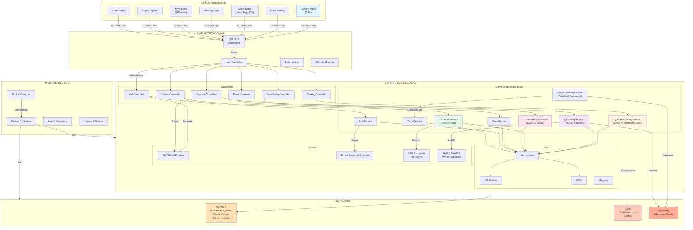
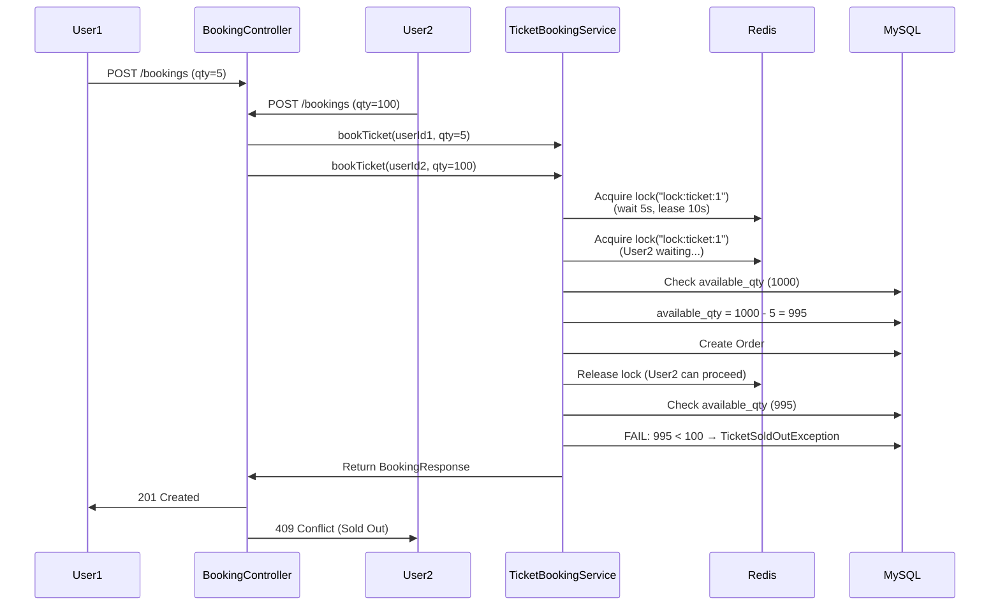
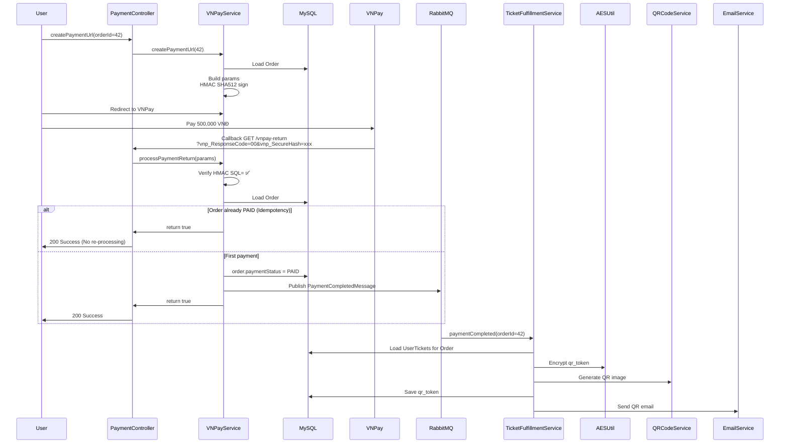
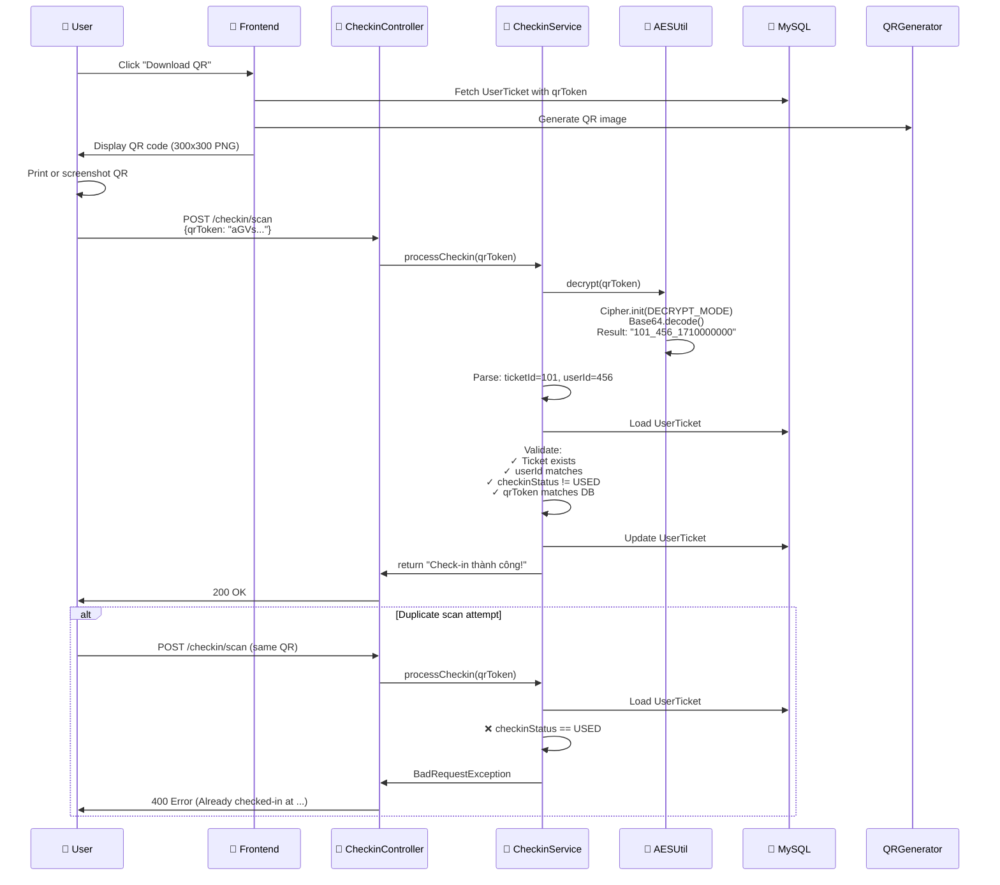
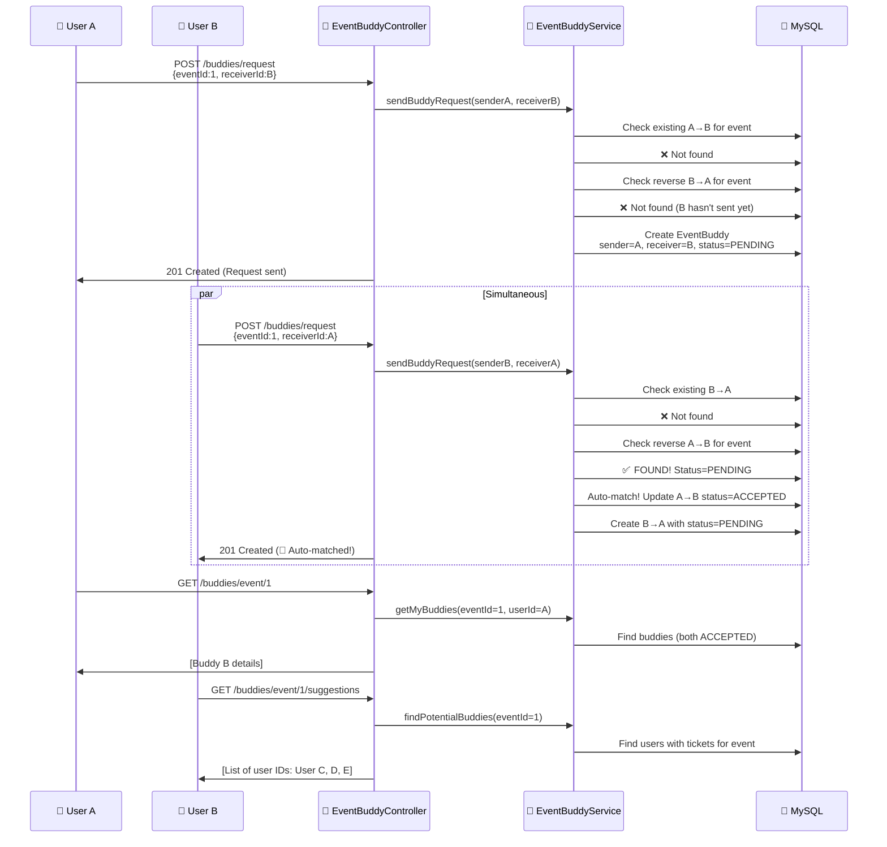

# 📋 SYSTEM ARCHITECTURE SUMMARY

## Project Overview

**Hệ Thống Quản Lý Sự Kiện & Bán Vé Online** dành cho sinh viên toàn thành phố.

- **Language:** Java 17 + Spring Boot 3
- **Frontend:** Next.js 14 (React 18) + SSR
- **Database:** MySQL 8 + Redis + RabbitMQ

---

## 🏛️ Complete Architecture Diagram

---

## 📊 Data Flow Diagrams

### 📌 TASK A: Ticket Booking Flow (Distributed Lock)

### 💳 TASK B: VNPay Payment Flow (Idempotency)

### 🔐 TASK C: QR Check-in Flow (AES Encryption)

### 👥 TASK D: Event Buddy Flow (Social)

---

## 🔧 Component Interaction Matrix

| Component | Uses | Purpose |
|-----------|------|---------|
| **TicketBookingService** | RedissonClient | Distributed lock |
| | TicketTypeRepository | Deduct available quantity |
| | OrderRepository | Create order |
| | UserTicketRepository | Create user tickets |
| **VNPayService** | OrderRepository | Load order |
| | RabbitTemplate | Publish message |
| | HMAC | Signature verification |
| **CheckinService** | UserTicketRepository | Load ticket |
| | AESUtil | Decrypt token |
| **EventBuddyService** | EventBuddyRepository | Find buddies |
| | EventRepository | Load event |
| | UserRepository | Load users |
| **TicketFulfillmentService** | UserTicketRepository | Load tickets |
| | AESUtil | Generate token |
| | QRCodeService | Generate QR image |

---

## 🔑 Key Technologies

### Concurrency Control
- **Redis Distributed Lock**: Prevents simultaneous access
- **Database Transaction**: ACID compliance

### Security
- **JWT (JJWT)**: Token-based auth
- **BCrypt**: Password hashing
- **AES/CBC/PKCS5**: Token encryption
- **HMAC SHA512**: VNPay signature

### Messaging
- **RabbitMQ**: Event-driven async processing
- **Publisher-Subscriber**: Decoupled services

### Code Quality
- **Spring Security**: Authorization
- **Validation**: JSR-303
- **Exception Handling**: Custom exceptions + GlobalExceptionHandler
- **Logging**: SLF4J + Logback

---

## 📈 Performance Metrics

| Metric | Target | Implementation |
|--------|--------|-----------------|
| **Booking Concurrency** | 1000 req/s | Distributed Lock |
| **DB Query Time** | <100ms | Indexed columns |
| **Lock Acquisition** | 5 seconds max | Redisson tryLock |
| **Payment Verification** | <500ms | HMAC pre-computed |
| **QR Generation** | <100ms | Async worker |
| **Check-in Time** | <3 seconds | Direct DB lookup |

---

## 🚀 Deployment Checklist

- [ ] Java 17 JDK installed
- [ ] MySQL 8 running & configured  
- [ ] Redis 6+ running & configured
- [ ] RabbitMQ 3.8+ running & configured
- [ ] Application.yml updated with production values
- [ ] Database migrations executed
- [ ] JWT secret (256+ bits) configured
- [ ] AES key (16 bytes) configured
- [ ] VNPay credentials set
- [ ] Email SMTP configured
- [ ] Nginx reverse proxy setup
- [ ] SSL certificates (Let's Encrypt) installed
- [ ] Environment variables exported
- [ ] Docker images built
- [ ] Health checks configured
- [ ] Monitoring & logging setup

---

## 📞 Support & Resources

- **Documentation**: See README.md, IMPLEMENTATION_GUIDE.md
- **Deployment**: See DEPLOYMENT.md
- **Troubleshooting**: See TROUBLESHOOTING.md
- **Frontend**: See FRONTEND_GUIDE.md
- **API Testing**: Import EventTicketSystem.postman_collection.json

---

**Status: ✅ COMPLETE & READY FOR PRODUCTION**
