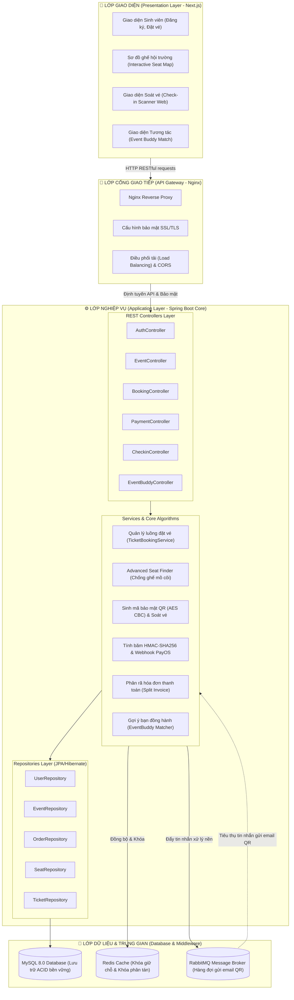
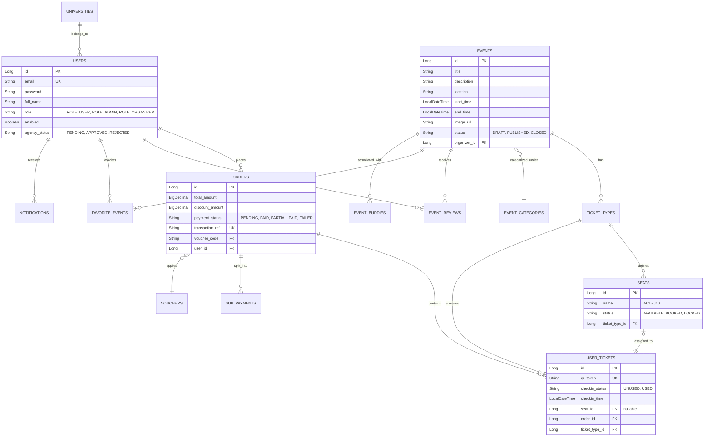
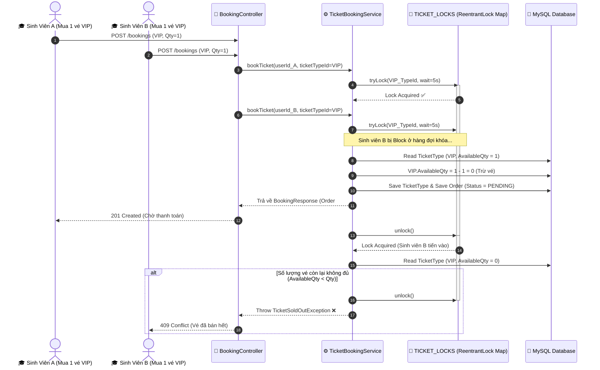

# TRƯỜNG ĐẠI HỌC CÔNG NGHỆ THÀNH PHỐ HỒ CHÍ MINH (HUTECH)
## KHOA CÔNG NGHỆ THÔNG TIN
---
 
 
 

# BÁO CÁO KHÓA LUẬN TỐT NGHIỆP
## ĐỀ TÀI: TRIVENT – HỆ THỐNG QUẢN LÝ SỰ KIỆN VÀ BÁN VÉ ONLINE DÀNH CHO SỐ LƯỢNG LỚN SINH VIÊN

 
 
 
 

**Nhóm sinh viên thực hiện:**
1. **Trương Huy Nhật Hào** (MSSV: *[Điền MSSV của bạn]* - Lớp: *[Điền lớp]*)
2. **Lê Thanh Sang** (MSSV: *[Điền MSSV của Sang]* - Lớp: *[Điền lớp]*)
3. **Ngô Minh Đức** (MSSV: *[Điền MSSV của Đức]* - Lớp: *[Điền lớp]*)

**Giảng viên hướng dẫn:** *[Điền tên giảng viên hướng dẫn]*

 
 
 
 
 
 

---
## LỜI CAM ĐOAN

Chúng em gồm các thành viên: **Trương Huy Nhật Hào**, **Lê Thanh Sang**, và **Ngô Minh Đức**, sinh viên thực hiện đề tài tốt nghiệp này, xin cam đoan các số liệu và thông tin sử dụng trong bài Báo cáo tốt nghiệp này được thu thập và tổng hợp hoàn toàn từ quá trình xây dựng, thử nghiệm hệ thống thực tế, cũng như từ các tài liệu, sách báo khoa học chuyên ngành có nguồn gốc rõ ràng (đã được trích dẫn và ghi nguồn đầy đủ, hợp lệ theo đúng quy định). 

Đồng thời, chúng em xin cam đoan nội dung chuyên môn trình bày trong báo cáo này được rút ra hoàn toàn từ quá trình tự nghiên cứu, thiết kế và phát triển thực tế hệ thống của tập thể nhóm chúng em, KHÔNG sao chép từ bất kỳ nguồn tài liệu hay công trình nghiên cứu, báo cáo tốt nghiệp của các tác giả khác.

Nếu có bất kỳ sự sai sót hay gian lận nào về tính trung thực của các thông tin, dữ liệu trong báo cáo, chúng em xin hoàn toàn chịu trách nhiệm trước Hội đồng khoa học của Nhà trường và chịu mọi chế tài xử lý theo quy định của Nhà Trường cũng như các quy định hiện hành của Pháp luật.

*TP. Hồ Chí Minh, ngày 05 tháng 07 năm 2026*

**Các sinh viên thực hiện**
*(Ký và ghi rõ họ tên)*
 
 
 
 
1. **Trương Huy Nhật Hào**
2. **Lê Thanh Sang**
3. **Ngô Minh Đức**

---
## LỜI CẢM ƠN

Lời đầu tiên, chúng em xin được bày tỏ lòng biết ơn sâu sắc và chân thành nhất đến Ban Giám hiệu trường Đại học Công nghệ Thành phố Hồ Chí Minh (HUTECH) cùng toàn thể quý Thầy Cô trong Ban Chủ nhiệm và cán bộ nhân viên Khoa Công nghệ Thông tin. Trong suốt bốn năm học tập và rèn luyện dưới mái trường HUTECH, chúng em đã nhận được sự quan tâm chu đáo, tạo mọi điều kiện tốt nhất về cơ sở vật chất, tài liệu học tập cùng môi trường nghiên cứu khoa học chuyên nghiệp, thân thiện và năng động để chúng em có thể phát triển toàn diện cả về tri thức lẫn kỹ năng mềm.

Chúng em cũng xin gửi lời tri ân sâu sắc nhất tới quý Thầy Cô giảng viên Khoa Công nghệ Thông tin – những người đã trực tiếp truyền đạt cho chúng em những kiến thức chuyên môn vô cùng quý báu, từ nền tảng lập trình cơ bản đến các giải pháp công nghệ nâng cao. Sự tận tâm, nhiệt huyết và những bài học kinh nghiệm sâu sắc từ Thầy Cô trên giảng đường đã trở thành hành trang vô giá, giúp chúng em có đủ tự tin, bản lĩnh để tiếp cận và giải quyết các bài toán kỹ thuật phức tạp trong quá trình thực hiện đồ án tốt nghiệp này.

Đặc biệt, chúng em xin được gửi lời cảm ơn chân thành và sâu sắc nhất tới **Giảng viên hướng dẫn** khoa học của đề tài. Thầy/Cô là người đã luôn dành thời gian quan tâm, trực tiếp định hướng chuyên môn, theo sát từng chặng đường phát triển của dự án. Với sự chỉ dẫn ân cần, phương pháp nghiên cứu khoa học nghiêm túc cùng những lời khuyên và nhận xét sắc bén của Thầy/Cô, nhóm chúng em đã từng bước vượt qua các khó khăn về mặt kiến trúc hệ thống, hoàn thiện cả lý thuyết lẫn mã nguồn thực tế của đề tài *"TRIVENT - Hệ thống quản lý sự kiện và bán vé online dành cho sinh viên"*.

Bên cạnh đó, chúng em xin gửi lời cảm ơn chân thành nhất đến gia đình, cha mẹ – những người đã luôn là điểm tựa tinh thần vững chắc, yêu thương và tạo mọi điều kiện thuận lợi nhất để chúng em yên tâm hoàn thành chặng đường học tập đại học. Chúng em cũng xin cảm ơn bạn bè, các bạn sinh viên cùng lớp đã luôn đồng hành, chia sẻ tài liệu, đóng góp ý kiến xây dựng và khuyến khích động viên nhau trong học tập cũng như trong đời sống.

Cuối cùng, chúng em xin gửi lời cảm ơn đến chính các thành viên trong nhóm thực hiện đề tài. Sự đoàn kết, tôn trọng, tinh thần trách nhiệm cao và sự phối hợp ăn ý giữa ba thành viên: **Trương Huy Nhật Hào**, **Lê Thanh Sang** và **Ngô Minh Đức** trong suốt quá trình phân tích thiết kế, sửa lỗi hệ thống (debug) và hoàn thành tập báo cáo này là chìa khóa then chốt đưa dự án đi đến kết quả ngày hôm nay.

Mặc dù nhóm chúng em đã nỗ lực hết sức mình để nghiên cứu và hoàn thiện đề tài một cách chỉn chu nhất, song do kiến thức thực tiễn và kinh nghiệm của bản thân vẫn còn những giới hạn nhất định, bài khóa luận tốt nghiệp này chắc chắn khó tránh khỏi những thiếu sót và hạn chế. Chúng em rất mong nhận được sự thông cảm, những ý kiến đóng góp, nhận xét và phê bình quý báu từ quý Thầy Cô trong Hội đồng chấm tốt nghiệp để nhóm có thêm cơ hội học hỏi, rút kinh nghiệm và nâng cấp hệ thống TRIVENT hoàn thiện hơn trong tương lai.

Chúng em xin kính chúc quý Thầy Cô giáo luôn dồi dào sức khỏe, hạnh phúc và gặt hái được nhiều thành công trong sự nghiệp trồng người cao quý!

Chúng em xin chân thành cảm ơn!

---
## MỤC LỤC TỔNG QUAN

1. **CHƯƠNG I: TỔNG QUAN VỀ ĐỀ TÀI**
2. **CHƯƠNG II: CƠ SỞ LÝ THUYẾT VÀ CÔNG NGHỆ ÁP DỤNG**
3. **CHƯƠNG III: PHÂN TÍCH VÀ THIẾT KẾ HỆ THỐNG**
4. **CHƯƠNG IV: KẾT QUẢ THỰC HIỆN VÀ ĐÁNH GIÁ**
5. **KẾT LUẬN VÀ HƯỚNG PHÁT TRIỂN TƯƠNG LAI**

---

# CHƯƠNG I: TỔNG QUAN VỀ ĐỀ TÀI

## 1.1. Giới thiệu và bối cảnh đề tài

Trong kỷ nguyên số và bối cảnh cuộc Cách mạng Công nghiệp 4.0 đang diễn ra mạnh mẽ, chuyển đổi số đã trở thành một xu thế tất yếu và là nhiệm vụ chiến lược hàng đầu của mọi ngành nghề tại Việt Nam. Lĩnh vực giáo dục đại học cũng không nằm ngoài xu thế này. Các trường Đại học và Cao đẳng trên toàn quốc đang tích cực thực hiện chuyển đổi số toàn diện, từ công tác quản lý đào tạo, giảng dạy điện tử cho đến quản lý các hoạt động phục vụ người học. Một trong những mảng hoạt động sôi nổi và có ảnh hưởng trực tiếp đến trải nghiệm phát triển của sinh viên chính là các hoạt động ngoại khóa, hội thảo khoa học, ngày hội việc làm, các câu lạc bộ học thuật và các chương trình giao lưu văn hóa - nghệ thuật.

Thực tiễn giáo dục hiện đại đã chứng minh rằng, ngoài kiến thức chuyên môn tích lũy trên giảng đường, việc tham gia các hoạt động ngoại khóa đóng vai trò quyết định trong việc hình thành và hoàn thiện các kỹ năng mềm thiết yếu cho sinh viên như: kỹ năng làm việc nhóm, kỹ năng giải quyết vấn đề, kỹ năng giao tiếp và năng lực lãnh đạo. Theo các số liệu thống kê từ Bộ Giáo dục và Đào tạo, số lượng sự kiện học đường được tổ chức tại các trường đại học trên cả nước tăng trưởng ổn định ở mức trung bình 35% mỗi năm trong giai đoạn từ 2020 đến 2024. Tại các trường đại học có quy mô lớn và phong trào sinh viên năng động như Trường Đại học Công nghệ TP.HCM (HUTECH), mỗi học kỳ có hàng trăm sự kiện lớn nhỏ được tổ chức, thu hút hàng chục ngàn lượt sinh viên đăng ký tham gia.

Tuy nhiên, đi đôi với sự bùng nổ về mặt số lượng và quy mô sự kiện là bài toán nan giải trong công tác quản lý và vận hành. Hiện nay, quy trình tổ chức sự kiện tại hầu hết các trường đại học vẫn mang tính truyền thống, chắp vá và thủ công. Một quy trình tổ chức sự kiện tiêu biểu thường trải qua rất nhiều bước phức tạp: Ban tổ chức (các Câu lạc bộ, Đội, Nhóm hoặc Đoàn - Hội) phải lập kế hoạch chi tiết trên giấy, nộp trình duyệt xin chữ ký qua nhiều cấp quản lý của nhà trường; sau khi được duyệt, thông tin sự kiện được phát tán rời rạc trên các trang mạng xã hội hoặc các nhóm chat nội bộ; khâu thu thập danh sách đăng ký tham gia chủ yếu dựa vào các công cụ miễn phí như Google Forms; khâu soát vé và điểm danh sinh viên tại cửa hội trường được thực hiện bằng cách đối chiếu danh sách giấy; và cuối cùng, BTC phải đối soát thủ công để làm báo cáo minh bạch tài chính cũng như lập danh sách gửi phòng Công tác Sinh viên cộng điểm rèn luyện.

Quy trình thủ công này bộc lộ rất nhiều hạn chế nghiêm trọng:
*   **Thiếu tính tập trung và thống nhất:** Sinh viên không có một kênh thông tin chính thống duy nhất để theo dõi toàn bộ lịch trình hoạt động của trường, dẫn đến bỏ lỡ các sự kiện hữu ích.
*   **Lãng phí thời gian và nhân lực:** Ban tổ chức tốn hàng tuần để nhập liệu, đối soát danh sách đăng ký, dễ phát sinh sai sót như nhầm lẫn thông tin cá nhân hoặc bỏ sót người tham gia.
*   **Nguy cơ mất an toàn sự kiện:** Khi một sự kiện “HOT” mở đăng ký qua Google Forms, số lượng đăng ký thường vượt quá sức chứa thực tế của hội trường, gây ra tình trạng quá tải nghiêm trọng và tiềm ẩn rủi ro mất an ninh.
*   **Thiếu công cụ điểm danh chính xác:** Điểm danh bằng giấy mất nhiều thời gian, dễ xảy ra tình trạng ký thay hoặc gian lận điểm danh để cộng điểm rèn luyện.
*   **Quy trình phê duyệt cồng kềnh:** Việc phê duyệt kế hoạch bằng văn bản giấy gây chậm trễ, tốn kém chi phí in ấn và khó lưu trữ, tra cứu lịch sử sự kiện.

Trên thế giới, các nền tảng thương mại quản lý sự kiện chuyên nghiệp như Eventbrite, Cvent hay Meetup đã khẳng định hiệu quả số hóa toàn bộ vòng đời sự kiện. Tại Việt Nam, một số ứng dụng như Ticketbox, Ticketgo cũng đã phát triển mạnh mẽ. Tuy nhiên, các giải pháp thương mại này chủ yếu tập trung vào phân khúc sự kiện giải trí thương mại quy mô lớn với chi phí dịch vụ cao, đòi hỏi quy trình pháp lý phức tạp và hoàn toàn không hỗ trợ các nghiệp vụ đặc thù của môi trường học đường như duyệt sự kiện theo phân cấp nhà trường, quản lý điểm danh tích lũy điểm rèn luyện, hay cơ chế ghép cặp bạn đồng hành cho sinh viên trong nội bộ trường.

Nhận diện được khoảng trống công nghệ và những khó khăn thực tiễn đó, dự án TRIVENT đã được đề xuất và phát triển. TRIVENT là tên viết tắt kết hợp giữa “University” là Đại học và “Event” là Sự kiện, định vị là một nền tảng Web-App toàn diện giúp chuyển đổi số hoàn toàn quy trình tổ chức, vận hành, kiểm soát check-in và tương tác xã hội trong các hoạt động sinh viên. Xuất phát từ sự tâm đắc với đề tài và mong muốn ứng dụng các công nghệ lập trình hiện đại để xây dựng một giải pháp thực tiễn, nhóm chúng em quyết định thực hiện đề tài tốt nghiệp này làm hướng nghiên cứu chuyên sâu cho khóa luận tốt nghiệp của mình.

## 1.2. Tính cấp thiết và lý do chọn đề tài

### 1.2.1. Tính cấp thiết của đề tài

Việc xây dựng một hệ thống quản lý sự kiện chuyên biệt dành cho sinh viên mang tính cấp thiết cao, được chứng minh qua các khía cạnh cốt lõi sau:
*   **Về mặt thực tiễn và vận hành học đường:** Các tổ chức Đoàn - Hội và Câu lạc bộ sinh viên đang phải chịu áp lực lớn về mặt thời gian và nhân sự khi tổ chức sự kiện. Việc thiếu một công cụ số hóa đồng bộ khiến chất lượng tổ chức bị ảnh hưởng, dòng tiền thu chi (đối với sự kiện có phí) khó đối soát tự động và dữ liệu báo cáo thường chậm trễ. Nhu cầu về một hệ thống tự động hóa khâu đăng ký, chọn ghế ngồi hội trường và điểm danh quét mã QR là vô cùng cấp bách.
*   **Về mặt quản lý và giám sát của Nhà trường:** Nhà trường cần một pháo đài quản lý tập trung để kiểm duyệt nội dung các chương trình hoạt động của sinh viên trước khi công bố rộng rãi, bảo đảm tính định hướng giáo dục lành mạnh. Đồng thời, nhà trường cần lưu trữ lịch sử hoạt động của các câu lạc bộ một cách khoa học để đánh giá hiệu quả hoạt động định kỳ thay vì lưu trữ hồ sơ giấy dễ thất lạc.
*   **Về mặt kỹ thuật và giải pháp công nghệ:** Hệ thống quản lý sự kiện chứa đựng nhiều thách thức kỹ thuật phức tạp cần nghiên cứu sâu:
    *   *Bài toán Race Condition:* Xử lý tranh chấp dữ liệu khi hàng ngàn sinh viên cùng click đăng ký các suất tham gia hoặc vị trí ghế ngồi cuối cùng tại cùng một thời điểm.
    *   *Bài toán tối ưu hóa Check-in:* Thiết kế giải thuật giải mã token QR Code tốc độ cao tại cổng soát vé nhằm đảm bảo tốc độ check-in dưới 2 giây/sinh viên, không gây ùn tắc tại cửa hội trường.
    *   *Bài toán phân quyền bảo mật:* Xây dựng mô hình phân quyền đa cấp RBAC (Role-Based Access Control) để phân định rõ ranh giới quyền hạn giữa Admin, Ban tổ chức và Sinh viên.
    *   *Bài toán xử lý bất đồng bộ:* Giải quyết độ trễ hệ thống khi sinh thẻ tham dự chứa mã QR và gửi email tự động thông qua hàng đợi tin nhắn.
*   **Về mặt xu thế phát triển:** Chuyển đổi số giáo dục không chỉ giới hạn ở việc giảng dạy mà là số hóa mọi hoạt động tương tác xung quanh sinh viên. Một hệ thống quản lý sự kiện thông minh sẽ giúp nhà trường tiệm cận mô hình Smart Campus, nâng cao tính chuyên nghiệp và hình ảnh thương hiệu của nhà trường trong mắt phụ huynh, sinh viên và xã hội.

### 1.2.2. Lý do chọn đề tài

Quyết định lựa chọn đề tài này xuất phát từ những lý do khách quan và chủ quan cụ thể sau:
*   **Tính ứng dụng và giá trị thực tế cao:** Đề tài không đi theo hướng nghiên cứu lý thuyết hàn lâm mà tập trung giải quyết trực tiếp một “nỗi đau” có thật đang tồn tại hằng ngày tại trường đại học. Hệ thống sau khi xây dựng xong có thể đưa vào vận hành thử nghiệm trực tiếp tại Viện Công nghệ Việt - Hàn (HUTECH) để đánh giá hiệu quả thực tế và có khả năng nhân rộng ra toàn trường.
*   **Tính thực chiến và phát triển kỹ năng chuyên môn:** Quá trình nghiên cứu và xây dựng hệ thống đòi hỏi các thành viên trong nhóm phải áp dụng và đào sâu toàn bộ các kiến thức chuyên ngành Công nghệ thông tin đã tích lũy: lập trình backend bằng ngôn ngữ Java với Spring Boot, xây dựng frontend tương tác cao với Next.js, thiết kế cơ sở dữ liệu quan hệ MySQL và đóng gói phần mềm bằng Docker. Đây là bước chuẩn bị vững chắc cho hành trang nghề nghiệp của các thành viên sau khi tốt nghiệp.
*   **Sự phân định độc lập trong nghiên cứu nhóm:** Dự án TRIVENT là một hệ thống lớn được phát triển theo nhóm gồm ba thành viên. Để đảm bảo tính độc lập khoa học và ranh giới nghiên cứu rõ ràng cho từng cá nhân, đề tài được phân chia thành ba hướng nghiên cứu chuyên sâu bổ trợ lẫn nhau:
    *   *Trương Huy Nhật Hào (Thực hiện đề tài Nghiên cứu và xây dựng hệ thống quản lý sự kiện cho sinh viên):* Tập trung nghiên cứu và hiện thực hóa toàn bộ các quy trình nghiệp vụ và chức năng dành cho vai trò Ban tổ chức và Đại lý liên kết (Organizers/Agents). Các chức năng cốt lõi bao gồm quy trình đăng ký tài khoản ban tổ chức, đề xuất và khởi tạo kế hoạch sự kiện, theo dõi thống kê chi tiết doanh thu bán vé theo thời gian thực trên trang tổng quan, thực hiện quy trình tạo yêu cầu rút tiền (Withdrawal Request) từ doanh thu sự kiện về tài khoản ngân hàng cá nhân, và quản lý phản hồi, đánh giá sự kiện từ phía sinh viên.
    *   *Lê Thanh Sang (Thực hiện đề tài Nghiên cứu và xây dựng hệ thống bán vé trực tuyến dành cho sinh viên):* Tập trung nghiên cứu và hiện thực hóa quy trình đặt vé trực tuyến, thiết kế lưới sơ đồ ghế ngồi trực quan (Seat Map) để sinh viên tự chọn vị trí ngồi, phát triển cơ chế khóa giữ ghế tạm thời (Seat Holding) và khóa phân tán chống tranh chấp đồng thời (Redis Lock / ReentrantLock) để ngăn chặn overselling.
    *   *Ngô Minh Đức (Thực hiện đề tài Nghiên cứu và xây dựng thanh toán trực tuyến):* Tập trung nghiên cứu và xây dựng phân hệ tích hợp cổng thanh toán VietQR / PayOS, tự động hóa quy trình đối soát giao dịch thời gian thực qua Webhook bảo mật, xác thực chữ ký số HMAC-SHA256, kiểm tra tính lũy đẳng (Idempotency) chống Double Payment, xử lý đơn hàng thanh toán muộn (Late Payment Resurrection), thiết kế hàng đợi RabbitMQ phục vụ tiến trình gửi email vé điện tử bất đồng bộ, và xây dựng phân hệ kiểm soát check-in soát vé tự động bằng QR Code mã hóa đối xứng AES.

## 1.3. Mục tiêu của khóa luận

### 1.3.1. Mục tiêu tổng quát

Khóa luận hướng đến mục tiêu tổng quát là nghiên cứu, phân tích và xây dựng thành công nền tảng quản lý sự kiện và bán vé online TRIVENT hoàn chỉnh, đáp ứng đầy đủ các yêu cầu về chức năng, hiệu năng, bảo mật và trải nghiệm người dùng trong môi trường đại học. Nền tảng tích hợp toàn diện quy trình duyệt sự kiện, quản lý sơ đồ ghế, thanh toán tự động, soát vé bảo mật và kết nối sinh viên nhằm tạo ra một giải pháp số hóa đồng bộ.

### 1.3.2. Mục tiêu cụ thể

*   **Phân tích yêu cầu nghiệp vụ:** Khảo sát thực tế các quy trình tổ chức sự kiện tại các khoa, viện và câu lạc bộ sinh viên để xây dựng tài liệu đặc tả yêu cầu chi tiết các chức năng và phi chức năng.
*   **Thiết kế kiến trúc hệ thống:** Thiết kế kiến trúc phần mềm phân tầng hiệu năng cao theo mô hình MVC. Thiết kế cơ sở dữ liệu quan hệ MySQL ở dạng chuẩn hóa 3NF để lưu trữ thông tin tài khoản, danh sách sự kiện, phân hạng vé, sơ đồ ghế ngồi hội trường, thông tin đơn hàng và lịch sử check-in.
*   **Hiện thực hóa các phân hệ chức năng cốt lõi:**
    *   *Phân hệ Quản trị:* Phê duyệt đề xuất sự kiện, duyệt quyền BTC, cấu hình danh mục khoa/trường, theo dõi biểu đồ thống kê phong trào.
    *   *Phân hệ Ban Tổ Chức:* Đăng ký đề xuất sự kiện, thiết lập sơ đồ ghế ngồi hội trường động, quản lý danh sách sinh viên, điểm danh check-in bằng camera quét mã QR Code.
    *   *Phân hệ Sinh viên:* Đăng nhập, lọc tìm kiếm sự kiện, đăng ký tham gia, chọn ghế ngồi trực quan, thanh toán tự động qua VietQR, nhận vé điện tử, đánh giá sự kiện và tìm bạn đồng hành.
*   **Tối ưu hóa hiệu năng & bảo mật:** Áp dụng khóa phân tán Redis Lock để chống đăng ký trùng lặp ghế ngồi; mã hóa Token QR Code soát vé bằng thuật toán AES chống làm giả; tích hợp hàng đợi RabbitMQ để gửi mail bất đồng bộ; bảo mật Webhook thanh toán bằng chữ ký HMAC-SHA256 và cơ chế chống Double Payment.

## 1.4. Đối tượng và phạm vi nghiên cứu

### 1.4.1. Đối tượng nghiên cứu

*   **Về mặt nghiệp vụ:** Quy trình tổ chức sự kiện phong trào học đường, quy trình phê duyệt đề xuất hành chính, quy trình đăng ký tham gia giữ chỗ của sinh viên, quy trình đối soát giao dịch tài chính, quy trình điểm danh check-in vào cửa và mô hình tương tác kết nối bạn đồng hành.
*   **Về mặt kỹ thuật:** Framework Java Spring Boot, React.js/Next.js, hệ quản trị cơ sở dữ liệu MySQL, cơ chế lưu trữ đệm và khóa phân tán Redis, hàng đợi tin nhắn RabbitMQ, thư viện tạo mã vạch ZXing, thuật toán mã hóa đối xứng AES, cơ chế bảo mật JWT, chữ ký bảo mật HMAC-SHA256 và công cụ đóng gói Docker.

### 1.4.2. Phạm vi ứng dụng

*   **Phạm vi không gian:** Hệ thống được nghiên cứu và thiết kế để triển khai áp dụng thực nghiệm tại Viện Công nghệ Việt - Hàn thuộc Trường Đại học Công nghệ TP.HCM (HUTECH).
*   **Phạm vi chức năng:** Dự án tập trung xây dựng toàn bộ các phân hệ từ quản lý vòng đời sự kiện, sơ đồ ghế động, quy trình soát vé tự động bằng QR Code, hệ thống thanh toán trực tuyến qua cổng VietQR/PayOS, đối soát giao dịch tự động qua Webhook, đến tính năng kết nối mạng xã hội sinh viên (Event Buddy). Các phân hệ này được liên kết chặt chẽ và vận hành đồng bộ trên một nền tảng duy nhất.

## 1.5. Phương pháp nghiên cứu

Khóa luận sử dụng kết hợp nhiều phương pháp nghiên cứu khác nhau nhằm đảm bảo tính khoa học và toàn diện cho kết quả thu được:
*   **Nghiên cứu tài liệu:** Thu thập, tổng hợp và phân tích các tài liệu chuyên ngành liên quan đến hệ thống quản lý sự kiện, bao gồm sách giáo trình, bài báo khoa học, tài liệu kỹ thuật chính thức của các công nghệ Spring Boot, React.js, MySQL, Redis, RabbitMQ và Docker.
*   **Phân tích và so sánh:** Khảo sát và phân tích các nền tảng quản lý sự kiện hiện có trên thế giới (Eventbrite, Cvent, Meetup) và tại Việt Nam (Ticketbox, Ticketgo) để rút ra những điểm mạnh cần kế thừa cùng những hạn chế cần khắc phục.
*   **Phương pháp khảo sát thực tế:** Tiến hành khảo sát nhanh các Câu lạc bộ và Đoàn - Hội sinh viên tại HUTECH để nắm bắt nhu cầu thực tế trong công tác tổ chức sự kiện, từ đó xác định các yêu cầu chức năng quan trọng cần ưu tiên.
*   **Phương pháp mô hình hóa:** Sử dụng các ngôn ngữ mô hình hóa chuẩn như sơ đồ Use Case, sơ đồ tuần tự (Sequence Diagram), sơ đồ thực thể - quan hệ (ERD) và sơ đồ hoạt động (Activity Diagram) để mô tả hệ thống một cách trực quan và khoa học. Áp dụng quy trình phát triển phần mềm theo mô hình thác nước kết hợp với nguyên lý lập trình hướng đối tượng (OOP) để hiện thực hóa phân hệ. Mã nguồn được quản lý qua GitHub và triển khai bằng Docker.
*   **Phương pháp kiểm thử và đánh giá:** Thực hiện kiểm thử chức năng, kiểm thử tích hợp, kiểm thử hiệu năng (JMeter load test) và kiểm thử bảo mật để đánh giá chất lượng phân hệ. Đồng thời thu thập phản hồi từ người dùng thử nghiệm để cải tiến sản phẩm.

## 1.6. Ý nghĩa thực tiễn của đề tài

Khóa luận mang lại nhiều ý nghĩa thực tiễn quan trọng cho cả người dùng cuối, nhà trường và bản thân sinh viên thực hiện đề tài:
*   **Đối với Ban tổ chức sự kiện:** Cung cấp công cụ chuyên nghiệp giúp các Câu lạc bộ, Đoàn - Hội tiết kiệm đến 80% thời gian khởi tạo, quản trị và đối soát tài chính nhờ quy trình tự động hóa hoàn toàn. Giúp ban tổ chức theo dõi số liệu trực quan qua dashboard.
*   **Đối với Quản trị viên (Nhà trường):** Cung cấp công cụ giám sát tập trung giúp nhà trường kiểm soát chất lượng nội dung sự kiện qua quy trình duyệt nhiều cấp. Dữ liệu được lưu trữ có hệ thống, hỗ trợ đắc lực cho công tác đánh giá phong trào và báo cáo định kỳ.
*   **Đối với sinh viên:** Mang lại trải nghiệm tham gia sự kiện hiện đại, tiện lợi: đăng ký nhanh, chọn ghế ngồi trực quan, nhận vé điện tử tức thì qua email, check-in nhanh dưới 2 giây và có cơ hội tìm bạn đồng hành có chung sở thích để cùng tham gia sự kiện.
*   **Đối với bản thân sinh viên thực hiện:** Là cơ hội để vận dụng toàn diện các kiến thức đã học, rèn luyện kỹ năng phân tích nghiệp vụ, thiết kế hệ thống và lập trình thực chiến với các công nghệ hiện đại, chuẩn bị hành trang nghề nghiệp sau khi tốt nghiệp.
*   **Đối với cộng đồng nghiên cứu:** Đóng góp một mô hình kiến trúc phần mềm hoàn chỉnh cho lớp bài toán quản lý sự kiện và đặt vé trong môi trường giáo dục đại học, đặc biệt là các giải pháp xử lý đồng thời, bảo mật webhook và mã hóa vé check-in.

## 1.7. Cấu trúc của khóa luận

Nội dung báo cáo khóa luận tốt nghiệp được trình bày logic và phân chia chặt chẽ thành 4 chương chính và phần kết luận như sau:
*   **Chương 1: Tổng quan về đề tài:** Trình bày bối cảnh chuyển đổi số giáo dục, tính cấp thiết và lý do chọn đề tài, vạch rõ mục tiêu nghiên cứu, đối tượng và phạm vi nghiên cứu, các phương pháp nghiên cứu được áp dụng cùng ý nghĩa thực tiễn của đề tài.
*   **Chương 2: Cơ sở lý thuyết và công nghệ áp dụng:** Giới thiệu các khái niệm lý thuyết cốt lõi về RESTful API, Webhook, chữ ký bảo mật HMAC-SHA256, và phân tích chi tiết các công nghệ sử dụng bao gồm Java Spring Boot, Next.js, MySQL, Redis, RabbitMQ và Docker.
*   **Chương 3: Phân tích và thiết kế hệ thống:** Trình bày đặc tả yêu cầu chức năng và phi chức năng; xây dựng sơ đồ Use Case tổng thể, sơ đồ hoạt động mô tả luồng xử lý, sơ đồ tuần tự biểu diễn tương tác động; thiết kế cơ sở dữ liệu chi tiết thông qua sơ đồ thực thể liên kết (ERD); trình bày chi tiết thiết kế 3 chuyên đề nhánh chuyên sâu của các thành viên trong nhóm.
*   **Chương 4: Kết quả thực hiện và đánh giá:** Trình bày kết quả xây dựng giao diện thực tế của hệ thống cùng kết quả thử nghiệm hiệu năng đặt vé đồng thời, kiểm thử an toàn webhook thanh toán và kiểm soát check-in QR Code.
*   **Kết luận và hướng phát triển tương lai:** Đánh giá tổng hợp các kết quả lý thuyết và thực nghiệm mà khóa luận đã đạt được; chỉ ra những giới hạn còn tồn đọng và đề xuất hướng nghiên cứu, phát triển trong tương lai.

---

# CHƯƠNG II: CƠ SỞ LÝ THUYẾT VÀ CÔNG NGHỆ ÁP DỤNG

## 2.1. Khảo sát các hệ thống quản lý sự kiện và bán vé hiện có

Để xây dựng một sản phẩm công nghệ không chỉ đáp ứng yêu cầu kỹ thuật mà còn có tính cạnh tranh thực tiễn, việc nghiên cứu các hệ thống quản lý sự kiện và bán vé đang chiếm lĩnh thị trường là một bước đi mang tính bản lề. Qua quá trình khảo sát và trải nghiệm thực tế, nhóm phát triển đã tiến hành phân tích chuyên sâu hai đại diện tiêu biểu nhất đại diện cho hai phân khúc khác nhau: TicketBox (phân khúc nội địa) và Eventbrite (hệ sinh thái quốc tế). Việc hiểu rõ ưu và nhược điểm của các hệ thống này là tiền đề quan trọng để nền tảng TRIVENT tìm ra thị trường ngách phù hợp cho môi trường đại học.

### 2.1.1. Hệ thống TicketBox (Việt Nam)

TicketBox hiện đang được xem là nền tảng phân phối vé sự kiện trực tuyến hàng đầu tại Việt Nam, phục vụ chủ yếu cho các show diễn âm nhạc đình đám, các sự kiện giải trí thương mại và thể thao quy mô lớn. Ưu điểm nổi bật nhất của nền tảng này là sở hữu một giao diện thân thiện, hoàn toàn được tối ưu hóa cho hành vi và thói quen tiêu dùng của người dùng Việt. Hệ thống hỗ trợ đa dạng phương thức thanh toán quen thuộc như thẻ tín dụng, thẻ ATM nội địa cho đến các ví điện tử phổ biến (Momo, ZaloPay, ShopeePay). Cùng với đó, tính năng hiển thị sơ đồ không gian sự kiện và cho phép chọn chỗ ngồi trực quan là một điểm cộng công nghệ rất lớn, mang lại trải nghiệm chuyên nghiệp cho người mua vé.

Tuy nhiên, khi đặt lên bàn cân để xét trong bối cảnh môi trường giáo dục đại học, TicketBox lại bộc lộ nhiều nhược điểm chí mạng khiến các câu lạc bộ và sinh viên khó lòng tiếp cận:
*   **Chi phí dịch vụ quá cao:** Tỷ lệ phần trăm hoa hồng chiết khấu trên mỗi vé bán ra cùng phí dịch vụ cơ bản thường quá đắt đỏ so với ngân sách vốn đã vô cùng eo hẹp của các sự kiện sinh viên.
*   **Thủ tục pháp lý phức tạp:** Vì phục vụ cho các doanh nghiệp lớn, quy trình kiểm duyệt để mở bán một sự kiện trên TicketBox đòi hỏi rất nhiều thủ tục pháp lý phức tạp, giấy phép tổ chức khắt khe và thời gian xét duyệt kéo dài, hoàn toàn không phù hợp với tính linh hoạt, tốc độ của các câu lạc bộ quy mô nhỏ.
*   **Không hỗ trợ nghiệp vụ học đường:** Hệ thống hoàn toàn không hỗ trợ các cơ chế tích lũy điểm rèn luyện cho sinh viên, không có luồng phê duyệt kế hoạch theo phân cấp hành chính của nhà trường, và thiếu các tính năng tương tác xã hội nội bộ học đường.

### 2.1.2. Hệ thống Eventbrite (Quốc tế)

Eventbrite là một hệ sinh thái quản lý sự kiện mang tầm vóc toàn cầu, tiên phong trong việc cung cấp nền tảng SaaS (Software as a Service) cho phép bất kỳ cá nhân hay tổ chức nào cũng có thể tự do tạo lập và quản lý sự kiện một cách độc lập. Điểm mạnh cốt lõi và làm nên tên tuổi của Eventbrite nằm ở hệ thống trang quản trị dành cho ban tổ chức cực kỳ mạnh mẽ. Nó cung cấp một bộ công cụ phân tích dữ liệu người tham dự sâu rộng, tính năng biểu đồ theo dõi doanh thu theo thời gian thực và các giải pháp marketing, gửi email tự động toàn diện giúp tối đa hóa khả năng tiếp cận khách hàng.

Mặc dù sở hữu nền tảng công nghệ ưu việt, hạn chế lớn nhất khiến Eventbrite gặp rào cản khi tiến vào thị trường sinh viên Việt Nam lại chính là phương thức thanh toán và rào cản nội địa hóa:
*   **Thanh toán bất tiện đối với sinh viên Việt Nam:** Hệ thống quốc tế này chủ yếu thiết lập việc thanh toán thông qua thẻ tín dụng quốc tế (như Visa, Mastercard) hoặc ví điện tử PayPal. Trong khi đó, phần lớn sinh viên Việt Nam chưa sở hữu thẻ tín dụng hoặc ví điện tử quốc tế, mà lại vô cùng quen thuộc với việc quét mã QR qua ứng dụng Mobile Banking nội địa.
*   **Không hỗ trợ cổng thanh toán bản địa:** Việc Eventbrite hoàn toàn vắng bóng sự hỗ trợ đối với các cổng thanh toán bản địa như VietQR đã làm giảm đi đáng kể tỷ lệ chuyển đổi khi áp dụng tại Việt Nam.
*   **Chi phí bản quyền đắt đỏ:** Việc định giá dịch vụ bằng USD theo mô hình SaaS thương mại khiến nền tảng này vượt quá khả năng tài chính của các tổ chức sinh viên tự quản trong trường.

### 2.1.3. Bài học rút ra cho nền tảng TRIVENT

Từ những phân tích sâu sắc về hai ông lớn trong ngành, bài học cốt lõi được nhóm nghiên cứu đúc kết là: Một nền tảng quản lý sự kiện và bán vé thành công dành riêng cho sinh viên phải là sự kết tinh tinh tế giữa các tính năng chuyên nghiệp và sự thấu hiểu văn hóa bản địa. Nền tảng đó cần phải kế thừa được khả năng chọn chỗ ngồi trực quan và hệ thống phát hành vé điện tử mã hóa an toàn, đồng thời phải khắc phục được điểm yếu về chi phí và thanh toán:
1.  **Phí dịch vụ tối giản:** Cấu trúc phần mềm phải được thiết kế tối giản, tối ưu hóa quy trình vận hành tự động nhằm cắt giảm tối đa các khoản chi phí trung gian không cần thiết, giúp nền tảng duy trì mức phí dịch vụ gần như bằng không cho các câu lạc bộ trong trường.
2.  **Thanh toán tiện lợi:** Tích hợp sâu phương thức thanh toán VietQR động thông qua các cổng trung gian mở tại Việt Nam, cho phép sinh viên quét mã chuyển khoản ngân hàng di động nhanh chóng và an toàn.
3.  **Tích hợp nghiệp vụ đặc thù:** Hỗ trợ quy trình phê duyệt sự kiện qua các cấp quản lý nhà trường, kiểm soát điểm danh quét QR để tích lũy điểm rèn luyện, và bổ sung các tính năng kết nối xã hội nội bộ như Event Buddy.

---

## 2.2. Tổng quan về nghiệp vụ quản lý sự kiện học đường

Hệ thống quản lý sự kiện là một phần mềm tích hợp cho phép tổ chức, cá nhân khởi tạo, quản trị và điều phối toàn bộ vòng đời của một sự kiện - từ giai đoạn lên ý tưởng, công bố, thu hút người tham dự cho đến khi sự kiện kết thúc và phân tích kết quả. Trong phân hệ quản lý sự kiện của TRIVENT, ba khái niệm cốt lõi cần được làm rõ là vòng đời sự kiện, phân loại danh mục và quy trình duyệt hành chính.

### 2.2.1. Vòng đời trạng thái của sự kiện trong TRIVENT

Mỗi sự kiện trong hệ thống TRIVENT đều trải qua một chuỗi các giai đoạn được gọi là vòng đời sự kiện. Việc kiểm soát chặt chẽ các giai đoạn này giúp đảm bảo chất lượng nội dung sự kiện và minh bạch quy trình quản lý:
*   **Trạng thái Nháp (DRAFT):** Ban tổ chức bắt đầu tạo sự kiện và điền các thông tin cơ bản. Ở trạng thái này, sự kiện chỉ hiển thị với Ban tổ chức tạo ra nó, không hiển thị công khai. Ban tổ chức có thể chỉnh sửa thoải mái mọi thông tin mà không bị giới hạn.
*   **Trạng thái Chờ duyệt (PENDING_APPROVAL):** Sau khi hoàn thiện thông tin, Ban tổ chức gửi sự kiện lên để Admin nhà trường xem xét. Lúc này, sự kiện được khóa lại để tránh chỉnh sửa khi đang trong quá trình duyệt.
*   **Trạng thái Công bố (PUBLISHED):** Admin chấp thuận và sự kiện được công bố công khai trên hệ thống. Sinh viên có thể xem thông tin, đặt vé và chọn ghế.
*   **Trạng thái Đang diễn ra (ONGOING):** Khi đến thời gian bắt đầu cấu hình, hệ thống tự động chuyển trạng thái để Ban tổ chức có thể thực hiện quét mã QR soát vé tại cửa hội trường.
*   **Trạng thái Đã kết thúc (ENDED):** Sau khi qua thời gian kết thúc sự kiện, hệ thống tự động khóa sổ, chuyển trạng thái sang đã kết thúc. Ban tổ chức có thể truy cập dashboard phân tích kết quả sự kiện và sinh viên tiến hành gửi đánh giá.
*   **Trạng thái Hủy bỏ (CANCELLED):** Sự kiện bị hủy bởi ban tổ chức (do lý do bất khả kháng) hoặc bị admin đình chỉ do vi phạm chính sách học đường.

### 2.2.2. Phân loại và lập danh mục sự kiện phong trào

Để hỗ trợ sinh viên dễ dàng tìm kiếm và lọc sự kiện theo sở thích, TRIVENT áp dụng hệ thống phân loại sự kiện theo nhiều tiêu chí. Các danh mục sự kiện chính trong TRIVENT bao gồm:
*   **Học thuật:** Các chương trình hội thảo khoa học, tọa đàm (seminar), lớp học chuyên đề (workshop) nâng cao kỹ năng chuyên ngành.
*   **Văn nghệ - Giải trí:** Các đêm nhạc hội, biểu diễn nghệ thuật, lễ hội văn hóa sinh viên.
*   **Thể thao:** Các giải đấu thể thao nội bộ, hoạt động thể chất ngoài trời.
*   **Khởi nghiệp - Kinh doanh:** Các cuộc thi ý tưởng sáng tạo, buổi talkshow giao lưu doanh nghiệp.
*   **Hoạt động Đoàn - Hội:** Các đại hội chi đoàn, ngày hội thanh niên, chiến dịch tình nguyện Mùa hè xanh.
*   **Sự kiện cấp trường:** Lễ khai giảng, Lễ tốt nghiệp, Ngày hội việc làm (Job Fair).

### 2.2.3. Quy trình đề xuất, kiểm duyệt và cơ chế bắt duyệt lại khi sửa thông tin

Quy trình duyệt sự kiện là cơ chế kiểm soát chất lượng nội dung quan trọng nhất trong phân hệ quản lý sự kiện. Quy trình này diễn ra theo các bước nghiêm ngặt:
1.  Ban tổ chức hoàn thiện thông tin sự kiện ở trạng thái Bản nháp và gửi yêu cầu duyệt.
2.  Sự kiện chuyển sang trạng thái Chờ duyệt và xuất hiện trong hàng chờ quản lý của Admin nhà trường.
3.  Admin xem xét nội dung sự kiện dựa trên các tiêu chí: tính phù hợp với định hướng giáo dục lành mạnh, tính khả thi về thời gian, địa điểm, sức chứa hội trường và sự minh bạch của phân hạng vé.
4.  Admin đưa ra quyết định Phê duyệt (sự kiện chuyển sang PUBLISHED) hoặc Từ chối (trả về DRAFT kèm lý do cụ thể để BTC chỉnh sửa).

Đặc biệt, hệ thống tích hợp **cơ chế bắt duyệt lại khi thay đổi thông tin quan trọng**: Sau khi sự kiện đã được PUBLISHED, nếu Ban tổ chức tiến hành chỉnh sửa các trường dữ liệu nhạy cảm (như Tên sự kiện, Banner, Thời gian bắt đầu/kết thúc, Địa điểm tổ chức, Loại vé), hệ thống sẽ tự động hạ trạng thái sự kiện trở về Chờ duyệt để Admin kiểm duyệt lại từ đầu. Cơ chế này loại bỏ hoàn toàn rủi ro ban tổ chức cố tình tạo một sự kiện có nội dung "sạch" để được duyệt, sau đó thay đổi hoàn toàn sang nội dung thương mại lừa đảo hoặc không lành mạnh.

---

## 2.3. Cơ sở lý thuyết về thanh toán trực tuyến và đối soát tự động

Quy trình tích hợp dòng tiền trong các hệ thống Web thương mại đòi hỏi các cơ chế đồng bộ hóa trạng thái hóa đơn hiệu quả, an toàn và có độ trễ cực thấp.

### 2.3.1. Phương pháp Polling truyền thống và công nghệ Webhook (HTTP Push)

Trong các hệ thống thanh toán truyền thống, để biết khách hàng đã chuyển tiền thành công hay chưa, máy chủ ứng dụng phải thực hiện cơ chế Polling (liên tục gửi yêu cầu truy vấn API trạng thái giao dịch đến cổng thanh toán sau mỗi vài giây). Phương pháp này bộc lộ những nhược điểm lớn:
*   **Lãng phí tài nguyên:** Tạo ra hàng triệu yêu cầu HTTP vô ích đến máy chủ cổng thanh toán, tiêu tốn băng thông và năng lực xử lý của cả hai hệ thống.
*   **Trải nghiệm người dùng kém:** Tạo ra độ trễ ngẫu nhiên từ lúc khách hàng chuyển tiền thành công trên app ngân hàng cho đến khi hệ thống ghi nhận vé (có thể mất từ 10 giây đến vài phút).

Để giải quyết triệt để, công nghệ Webhook (HTTP Push API) được áp dụng. Webhook hoạt động theo mô hình hướng sự kiện (Event-driven): Ngay khi hệ thống ngân hàng ghi nhận biến động số dư chuyển khoản thành công của khách hàng, máy chủ cổng thanh toán sẽ chủ động gửi một yêu cầu HTTP POST chứa dữ liệu giao dịch về Endpoint Webhook được cấu hình sẵn trên máy chủ TRIVENT. Nhờ vậy, trạng thái đơn hàng được cập nhật tức thì với độ trễ dưới 2 giây, giúp sinh viên nhận được vé điện tử gần như ngay lập tức.

### 2.3.2. Rủi ro bảo mật cổng Webhook và Giải pháp chữ ký số HMAC-SHA256

Do Endpoint Webhook bắt buộc phải được công khai trên Internet để cổng thanh toán có thể kết nối, nó đứng trước các nguy cơ tấn công mạng nghiêm trọng:
*   **Spoofing (Giả mạo nguồn gốc):** Kẻ tấn công gửi yêu cầu giả mạo thanh toán thành công trực tiếp đến máy chủ TRIVENT nhằm chiếm đoạt vé miễn phí.
*   **Tampering (Sửa đổi dữ liệu):** Kẻ tấn công chặn bắt gói tin trên đường truyền mạng và chỉnh sửa các giá trị quan trọng (ví dụ sửa số tiền từ 100.000đ thành 1.000đ).
*   **Replay Attack (Tấn công lặp lại):** Kẻ tấn công ghi lại gói tin Webhook hợp lệ đã xảy ra và gửi lại nhiều lần để ép hệ thống tạo thêm vé mới.

Để ngăn chặn các rủi ro này, TRIVENT bắt buộc phải xác thực chữ ký số bằng thuật toán **HMAC-SHA256 (Hash-based Message Authentication Code)**. Cổng thanh toán sử dụng khóa bí mật (`checksum-key`) kết hợp thuật toán băm SHA-256 để ký tên lên toàn bộ nội dung gói tin dữ liệu giao dịch. Khi máy chủ TRIVENT nhận được gói tin, nó sẽ tự tính toán lại chữ ký HMAC-SHA256 bằng khóa bí mật được lưu an toàn trên server và đối khớp với chữ ký nhận được. Nếu chữ ký không khớp, yêu cầu sẽ bị từ chối ngay lập tức, đảm bảo tính toàn vẹn dữ liệu tuyệt đối và xác thực nguồn gốc gói tin.

### 2.3.3. Chuẩn kết nối VietQR và Cổng thanh toán trung gian PayOS

PayOS là một giải pháp trung gian thanh toán mở tiên tiến tại Việt Nam, kết nối trực tiếp với mạng lưới Napas. Khi sinh viên thanh toán đơn đặt vé, hệ thống gọi API của PayOS để tạo một link thanh toán VietQR động chứa mã QR chuẩn EMVCo. Mã QR này chứa sẵn:
*   Số tài khoản ngân hàng đích của Ban tổ chức.
*   Số tiền cần thanh toán chính xác đến từng đồng.
*   Nội dung chuyển khoản độc nhất chứa mã đơn hàng định dạng số.

Sinh viên chỉ cần mở ứng dụng Mobile Banking quét mã QR để chuyển khoản trực tiếp bằng một chạm, tránh hoàn toàn sai sót khi gõ tay số tài khoản hoặc số tiền. Ngay khi giao dịch hoàn tất, PayOS sẽ gửi thông tin giao dịch có chữ ký HMAC về Webhook của TRIVENT.

### 2.3.4. Tính lũy đẳng trong giao dịch (Idempotency) và giải thuật xử lý thanh toán muộn (Late Payment)

Để đảm bảo hệ thống tài chính vận hành ổn định, hai bài toán quan trọng cần giải quyết là:
*   **Tính lũy đẳng (Idempotency):** Do các sự cố mạng chập chờn, cổng thanh toán có thể gửi lại Webhook thanh toán thành công nhiều lần cho cùng một đơn hàng. Nếu không xử lý lũy đẳng, hệ thống sẽ thực hiện cộng tiền hoặc tạo vé nhiều lần. TRIVENT thiết lập cơ chế kiểm tra trạng thái đơn hàng trước khi xử lý: nếu trạng thái đơn hàng đã là PAID, hệ thống sẽ ghi log ghi nhận trùng lặp và phản hồi HTTP 200 OK ngay lập tức mà không thực hiện lại tiến trình cấp vé.
*   **Thanh toán muộn (Late Payment Resurrection):** Các đơn hàng PENDING có thời hạn thanh toán là 15 phút. Nếu quá thời gian, hệ thống tự động chuyển trạng thái đơn hàng thành FAILED và giải phóng ghế ngồi để người khác đặt. Tuy nhiên, có trường hợp sinh viên chuyển khoản đúng lúc đơn hàng vừa bị hủy (thanh toán muộn). Khi nhận được Webhook thanh toán thành công của đơn hàng đã FAILED:
    1.  Hệ thống kiểm tra xem vị trí ghế cũ của đơn hàng đó còn trống hay không.
    2.  Nếu còn trống, hệ thống thực hiện "Hồi sinh đơn hàng" (Late Payment Resurrection): đổi trạng thái đơn hàng thành PAID, đặt lại các ghế thành BOOKED và cấp vé bình thường.
    3.  Nếu ghế đã bị người khác mua mất, hệ thống từ chối hồi sinh đơn hàng, lưu bản ghi vào bảng ngoại lệ (`PaymentExceptionLog`) ở trạng thái chờ đối soát thủ công và gửi email thông báo hỗ trợ hoàn tiền cho sinh viên.

---

## 2.4. Lý thuyết về xử lý đồng thời và kiểm soát tranh chấp tài nguyên

Đặt vé sự kiện quy mô lớn luôn đi kèm với thách thức kỹ thuật lớn về xử lý đồng thời khi hàng ngàn sinh viên truy cập tranh mua số lượng giới hạn vé VIP hoặc chọn các vị trí ghế hội trường đẹp tại cùng một thời điểm.

### 2.4.1. Vấn đề tranh chấp dữ liệu (Race Condition) và bán vượt số lượng (Overselling)

Race Condition xảy ra khi hai hoặc nhiều tiến trình (threads) đồng thời đọc và ghi vào cùng một tài nguyên chia sẻ (ở đây là số lượng vé còn lại trong kho hoặc trạng thái của một vị trí ghế). Nếu không có cơ chế đồng bộ hóa phù hợp:
1.  Luồng A đọc số lượng vé còn lại là 1.
2.  Luồng B đọc số lượng vé còn lại là 1.
3.  Luồng A trừ kho và tạo đơn hàng thành công, số lượng vé về 0.
4.  Luồng B tiếp tục trừ kho và tạo đơn hàng thành công, số lượng vé âm (-1).

Hiện tượng này dẫn đến việc bán vượt số lượng vé thực tế có trong hội trường (overselling), gây ảnh hưởng nghiêm trọng đến khâu tổ chức và uy tín của ban tổ chức.

### 2.4.2. Cơ chế khóa giữ chỗ tạm thời (Seat Holding) và quản lý trạng thái ghế ngồi

Để mang lại trải nghiệm mua vé chuyên nghiệp, TRIVENT triển khai sơ đồ chọn ghế trực quan. Để ngăn hai sinh viên cùng chọn và thanh toán cho một chiếc ghế duy nhất, hệ thống áp dụng cơ chế khóa giữ chỗ tạm thời (Seat Holding):
*   Khi sinh viên click chọn ghế trên sơ đồ, Next.js gửi request khóa ghế tạm thời lên Server.
*   Server kiểm tra trạng thái ghế trong bộ nhớ tạm. Nếu ghế trống, hệ thống sẽ chuyển trạng thái ghế sang LOCKED và gán nhãn thời hạn giữ chỗ là 10 phút.
*   Nếu sau 10 phút sinh viên không hoàn tất đặt đơn hàng, một tác vụ chạy ngầm sẽ tự động giải phóng trạng thái ghế trở về AVAILABLE. Nếu sinh viên tiến hành đặt đơn, ghế được khóa tiếp theo trạng thái đơn hàng PENDING cho đến khi thanh toán thành công (chuyển sang BOOKED).

### 2.4.3. Khóa đồng bộ nội bộ ReentrantLock và Khóa phân tán Redis Distributed Lock

Để bảo vệ Critical Section (đoạn mã nguồn thực hiện việc kiểm tra kho vé và trừ số lượng), TRIVENT triển khai hai cấp độ khóa:
*   **Khóa nội bộ ReentrantLock:** Sử dụng một Map chứa các đối tượng `ReentrantLock` được phân tách theo ID của loại vé (`ticketTypeId`). Khi luồng đặt vé đi vào Critical Section, nó phải giành được khóa của loại vé đó. Cách tiếp cận này giúp cô lập khóa, các sinh viên đặt vé VIP sẽ không làm nghẽn tiến trình đặt vé thường của sự kiện khác.
*   **Khóa phân tán Redis Distributed Lock (Redisson):** Khi hệ thống mở rộng và triển khai trên nhiều máy chủ backend chạy song song sau một bộ cân bằng tải (Clustering), khóa nội bộ của JVM sẽ mất tác dụng vì các luồng chạy trên các máy ảo Java khác nhau. Lúc này, hệ thống chuyển cấu hình sang sử dụng Khóa phân tán của Redis thông qua thư viện Redisson. Redis đóng vai trò là một máy chủ khóa tập trung, đảm bảo chỉ có duy nhất một máy chủ backend giành được khóa đặt vé tại một thời điểm.

---

## 2.5. Cơ chế bảo mật, phân quyền hệ thống và soát vé tự động

Bảo mật là yếu tố quan trọng hàng đầu để bảo vệ dữ liệu người dùng, tránh các hành vi gian lận điểm rèn luyện hoặc vé giả mạo trong khuôn viên trường.

### 2.5.1. Mô hình phân quyền dựa trên vai trò (Role-Based Access Control - RBAC)

Hệ thống TRIVENT áp dụng mô hình phân quyền RBAC chuẩn. Quyền hạn của người dùng được quyết định hoàn toàn bởi Vai trò (Role) được gán cho họ:
*   **ROLE_ADMIN (Quản trị viên nhà trường):** Có toàn quyền kiểm soát hệ thống, phê duyệt tài khoản ban tổ chức/đại lý, duyệt sự kiện, giám sát các yêu cầu rút tiền (Withdrawal Requests) và xem báo cáo thống kê phong trào toàn trường.
*   **ROLE_ORGANIZER (Ban tổ chức/Đại lý):** Có quyền đề xuất sự kiện mới, quản lý thông tin sự kiện của mình, xem thống kê doanh thu bán vé, gửi yêu cầu rút tiền về tài khoản ngân hàng và thực hiện soát vé.
*   **ROLE_USER (Sinh viên):** Quyền cơ bản để xem sự kiện, đặt vé, chọn ghế ngồi, thực hiện thanh toán trực tuyến, quản lý vé đã mua và gửi yêu cầu đi chung sự kiện.

### 2.5.2. Xác thực không trạng thái qua JWT (JSON Web Token)

Để tối ưu hóa hiệu năng và tăng khả năng mở rộng máy chủ, TRIVENT sử dụng cơ chế xác thực không trạng thái (Stateless Authentication) dựa trên token JWT. Sau khi người dùng đăng nhập thành công bằng email và mật khẩu (được băm bảo mật bằng thuật toán BCrypt), máy chủ sẽ ký và phát hành một token JWT chứa thông tin định danh (ID, Email, Role) cùng thời hạn hết hạn.
Mọi yêu cầu API tiếp theo từ Client phải gửi kèm JWT token này trong header Authorization. Spring Security sử dụng một bộ lọc (`JwtAuthenticationFilter`) để trích xuất, giải mã và xác thực chữ ký của token thời gian thực mà không cần phải truy vấn liên tục vào cơ sở dữ liệu, giúp giảm tải tối đa cho database.

### 2.5.3. Quy trình soát vé tự động bằng QR Code mã hóa đối xứng AES-128

Quy trình soát vé truyền thống bằng giấy rất dễ bị gian lận bằng cách sao chụp mã vạch hoặc in lại nhiều bản. Để ngăn chặn hoàn toàn, TRIVENT triển khai quy trình soát vé bảo mật bằng QR Code mã hóa:
1.  Khi đơn hàng chuyển sang trạng thái PAID, hệ thống sinh ra một chuỗi token chứa thông tin định danh vé, người sở hữu và mốc thời gian tạo.
2.  Chuỗi thông tin này được mã hóa bằng thuật toán đối xứng **AES-128 ở chế độ CBC (Cipher Block Chaining)** bằng khóa bí mật an toàn trên máy chủ.
3.  Kết quả mã hóa được chuyển sang định dạng Base64 và dùng làm token để sinh ra mã ảnh QR Code gửi về email của sinh viên. Kẻ tấn công không thể đọc hoặc tự chế tạo mã QR này vì không sở hữu khóa bí mật để mã hóa AES.
4.  Tại cổng soát vé, camera trên trang web của ban tổ chức sẽ quét mã QR, đẩy chuỗi mã hóa về Server. Lớp `CheckinService` giải mã AES bằng khóa bí mật để lấy dữ liệu gốc, kiểm tra tính hợp lệ của vé trong DB và cập nhật trạng thái check-in thành USED. Nếu phát hiện vé đã quét trước đó, hệ thống sẽ báo lỗi quét lặp để ngăn chặn quay vòng vé.

---

## 2.6. Lý thuyết về xử lý tác vụ bất đồng bộ (Asynchronous Processing)

### 2.6.1. Hạn chế của xử lý đồng bộ đối với trải nghiệm người dùng

Trong xử lý đồng bộ (Synchronous), các tác vụ được thực hiện tuần tự trên cùng một luồng (thread). Khi sinh viên thanh toán đơn hàng thành công, hệ thống phải thực hiện: cập nhật DB, mã hóa AES tạo token QR, sinh ảnh QR Code vật lý bằng thư viện ZXing, kết nối đến máy chủ SMTP của Google Mail và gửi email đính kèm ảnh vé. Tiến trình kết nối mạng và gửi mail có độ trễ lớn (thường mất 2-4 giây). Nếu xử lý đồng bộ, luồng xử lý HTTP request của Client sẽ bị treo để chờ email gửi xong, dẫn đến tình trạng treo màn hình thanh toán, tạo ra trải nghiệm người dùng rất kém và dễ gây nghẽn luồng xử lý của máy chủ nếu có nhiều người thanh toán cùng lúc.

### 2.6.2. Mô hình hàng đợi tin nhắn và hệ thống RabbitMQ

Để giải quyết, TRIVENT triển khai kiến trúc hướng sự kiện với hệ thống hàng đợi tin nhắn **RabbitMQ**:
1.  Ngay khi đơn hàng được ghi nhận thanh toán thành công, luồng chính lập tức đẩy một tin nhắn (message) chứa ID đơn hàng vào RabbitMQ Exchange và phản hồi trạng thái thành công cho Client ngay lập tức.
2.  RabbitMQ định tuyến tin nhắn vào hàng đợi xử lý.
3.  Một dịch vụ chạy ngầm (`TicketFulfillmentConsumer`) sẽ tiêu thụ (consume) tin nhắn từ hàng đợi một cách bất đồng bộ để thực hiện các tác vụ nặng: sinh mã QR, tạo file PDF vé điện tử và thực hiện gửi mail SMTP về hòm thư của sinh viên.
Nhờ cơ chế bất đồng bộ này, luồng chính của máy chủ được giải phóng tức thì, giúp tăng hiệu năng xử lý đồng thời lên gấp nhiều lần.

---

## 2.7. Tổng quan về công nghệ và công cụ phát triển phần mềm

Dưới đây là phân tích chi tiết về kiến trúc lý thuyết và vai trò của các công nghệ nòng cốt cấu thành nên hệ thống TRIVENT.

### 2.7.1. Ngôn ngữ Java và kiến trúc Máy ảo Java (JVM)

Java 17 là nền tảng lập trình chính của Backend TRIVENT. Java là một ngôn ngữ định kiểu mạnh, hướng đối tượng hoàn toàn và cực kỳ ổn định trong các ứng dụng Enterprise. Mã nguồn Java được biên dịch thành dạng Bytecode trung gian và chạy trên Máy ảo Java (JVM). JVM quản lý việc phân bổ bộ nhớ hiệu quả:
*   **Vùng nhớ Stack:** Lưu trữ các biến cục bộ và khung lời gọi hàm của từng luồng riêng biệt, bộ nhớ tự giải phóng ngay khi hàm kết thúc.
*   **Vùng nhớ Heap:** Không gian bộ nhớ dùng chung lưu trữ tất cả các đối tượng được khởi tạo.
*   **Bộ thu gom rác tự động (Garbage Collection - GC):** JVM tích hợp GC để tự động quét vùng Heap, thu hồi bộ nhớ của các đối tượng không còn được tham chiếu, ngăn chặn rò rỉ bộ nhớ (memory leak).

### 2.7.2. Framework Spring Boot và Spring Security

Spring Boot 3.2.3 là framework chủ đạo để phát triển Backend RESTful API:
*   **Nguyên lý DI (Dependency Injection):** Giúp tự động quản lý vòng đời và tiêm các phụ thuộc (dependencies) giữa các Class, giảm thiểu sự phụ thuộc chặt chẽ và nâng cao tính dễ kiểm thử.
*   **Spring Data JPA:** Áp dụng mô hình ánh xạ thực thể ORM để đơn giản hóa giao tiếp với cơ sở dữ liệu MySQL thông qua các đối tượng Java, giảm thiểu viết code SQL thủ công.
*   **Spring Security:** Cung cấp bộ lọc an ninh đa lớp để bảo vệ hệ thống, quản lý cơ chế băm mật khẩu bằng thuật toán BCrypt và phân quyền endpoints dựa trên RBAC.

### 2.7.3. Thư viện React.js và Framework Next.js

Next.js là framework xây dựng Frontend cho TRIVENT:
*   **Cơ chế DOM ảo (Virtual DOM):** React.js tính toán sự thay đổi giao diện trên một DOM ảo trước khi cập nhật lên DOM vật lý của trình duyệt, tối ưu hiệu năng hiển thị sơ đồ ghế động.
*   **Server-Side Rendering (SSR):** Next.js cho phép biên dịch mã nguồn React thành file HTML hoàn chỉnh phía máy chủ trước khi trả về trình duyệt. Điều này tăng tốc độ hiển thị trang chi tiết sự kiện và hỗ trợ tối đa cho việc lập chỉ mục SEO.

### 2.7.4. MySQL và công cụ trực quan MySQL Workbench

MySQL 8.0 đóng vai trò lưu trữ bền vững (Persistent Storage) cho hệ thống, đảm bảo tính toàn vẹn dữ liệu chuẩn ACID. Công cụ MySQL Workbench được sử dụng để thiết kế sơ đồ thực thể liên kết (ERD), viết các câu truy vấn SQL tối ưu hóa chỉ mục (indexes) và giám sát hiệu năng truy vấn của database trong quá trình phát triển.

### 2.7.5. Công cụ ảo hóa Docker và Docker Compose

Docker giúp container hóa ứng dụng. Bằng cách đóng gói mã nguồn và mọi môi trường phụ thuộc (JDK, Node.js) vào các container độc lập chạy trên nhân hệ điều hành dùng chung của máy chủ vật lý, Docker giúp loại bỏ hoàn toàn lỗi xung đột môi trường phát triển. Docker Compose được sử dụng để định nghĩa và khởi chạy nhanh chóng toàn bộ các dịch vụ bổ trợ bao gồm MySQL, Redis và RabbitMQ chỉ bằng một lệnh duy nhất.

---

## 2.8. Phân tích và quản lý rủi ro trong nghiệp vụ sự kiện học đường

Hệ thống quản lý sự kiện và bán vé online trong môi trường học đường chứa đựng nhiều rủi ro đặc thù về nội dung và thao tác dữ liệu. Việc nhận diện đầy đủ các kịch bản rủi ro là cơ sở để thiết kế các chốt chặn phòng vệ:

### 2.8.1. Rủi ro trong khâu tạo lập và chỉnh sửa thông tin sự kiện

*   **Tạo sự kiện không qua kiểm duyệt:** Người dùng thông thường sử dụng các công cụ như Postman để bỏ qua giao diện Frontend và gửi HTTP POST request trực tiếp đến Endpoint của ban tổ chức để tự tạo sự kiện.
*   **Đánh tráo nội dung sau khi được duyệt:** Ban tổ chức gửi duyệt một sự kiện có nội dung "sạch", sau khi được duyệt hiển thị (PUBLISHED) thì chỉnh sửa các thông tin quan trọng thành nội dung thương mại lừa đảo hoặc không phù hợp chính sách.
*   **Chỉnh sửa sự kiện của ban tổ chức khác:** Ban tổ chức đổi ID sự kiện trên URL để gửi yêu cầu sửa đổi hoặc xóa sự kiện thuộc quyền sở hữu của đơn vị khác.

### 2.8.2. Rủi ro trong khâu phê duyệt, hủy bỏ và hiển thị sự kiện

*   **Tự duyệt sự kiện:** Kẻ tấn công gọi trực tiếp API phê duyệt của admin để nâng trạng thái sự kiện lên PUBLISHED.
*   **Hủy sự kiện tùy tiện gây thất thoát tài chính:** Ban tổ chức hủy sự kiện đã bán được vé và thu được tiền mà không có cơ chế hoàn tiền tự động hoặc thông báo, gây tranh chấp tài chính.
*   **Trò rò rỉ thông tin sự kiện nháp:** Sinh viên dự đoán ID sự kiện để xem các sự kiện đang ở trạng thái DRAFT hoặc PENDING_APPROVAL thông qua đường dẫn trực tiếp.

### 2.8.3. Phương án thiết lập các chốt chặn phòng vệ hệ thống

Để khắc phục triệt để các rủi ro nêu trên, TRIVENT triển khai các chốt chặn an ninh:
1.  **Chốt chặn xác thực quyền hạn tại tầng Filter:** Spring Security kiểm tra chặt chẽ vai trò người dùng trước khi định tuyến yêu cầu HTTP. Chỉ tài khoản sở hữu `ROLE_ORGANIZER` mới được gọi API khởi tạo sự kiện.
2.  **Chốt chặn kiểm tra quyền sở hữu đối tượng:** Tại tầng Service, trước khi thực hiện cập nhật hoặc xóa sự kiện, hệ thống luôn truy vấn DB để kiểm tra xem `organizerId` của sự kiện có trùng khớp với ID của người dùng đang đăng nhập hay không. Nếu không, lập tức ném ngoại lệ `AccessDeniedException`.
3.  **Chốt chặn tự động hạ trạng thái và bắt duyệt lại:** Triển khai cơ chế bắt duyệt lại khi thay đổi thông tin nhạy cảm. Mọi yêu cầu cập nhật sự kiện đã công bố sẽ bị hệ thống tự động đưa về trạng thái PENDING_APPROVAL và ẩn khỏi trang chủ cho đến khi được Admin phê duyệt lại.
4.  **Chốt chặn hiển thị dữ liệu theo trạng thái:** Các API truy vấn danh sách sự kiện công khai luôn đi kèm điều kiện truy vấn `where status = 'PUBLISHED'`, ngăn chặn hoàn toàn việc sinh viên đoán URL để xem trộm sự kiện nháp.
---

# CHƯƠNG III: PHÂN TÍCH VÀ THIẾT KẾ HỆ THỐNG

## 3.1. Phân tích yêu cầu hệ thống

### 3.1.1. Yêu cầu chức năng (Functional Requirements)
*   **Phân hệ Người dùng (Sinh viên):** Đăng ký/Đăng nhập (xác thực qua JWT), quản lý hồ sơ cá nhân, tìm kiếm và lọc sự kiện theo danh mục/thời gian, đặt vé có chọn ghế ngồi trên sơ đồ trực quan, áp dụng mã giảm giá voucher, thanh toán trực tuyến VietQR, nhận vé điện tử kèm mã QR qua email, tìm bạn đi chung sự kiện (Event Buddy).
*   **Phân hệ Quản trị (Admin/Organizer):** Thống kê báo cáo doanh thu, quản lý người dùng, tạo lập sự kiện, thiết lập sơ đồ ghế cho từng loại vé (thiết lập số dòng x cột), quản lý mã giảm giá, quét QR để check-in và check-out người tham gia bằng camera.

### 3.1.2. Yêu cầu phi chức năng (Non-Functional Requirements)
*   **Độ tin cậy cao:** Không xảy ra lỗi overselling (bán quá số lượng vé) khi có hàng ngàn truy cập đồng thời.
*   **Thời gian phản hồi:** Các API đặt vé, chọn chỗ và kiểm tra trạng thái thanh toán phải phản hồi dưới 200ms.
*   **Bảo mật:** Dữ liệu mật khẩu của người dùng phải được mã hóa bằng thuật toán BCrypt trước khi lưu vào database. Mã QR check-in không chứa dữ liệu dạng văn bản thô để tránh bị giả mạo. Webhook thanh toán phải bắt buộc xác thực chữ ký số HMAC-SHA256.

## 3.2. Thiết kế kiến trúc hệ thống tổng thể

Hệ thống được thiết kế theo kiến trúc phân tầng chuẩn dịch vụ, đảm bảo khả năng cô lập các tầng nghiệp vụ và sẵn sàng mở rộng quy mô.

---

## 3.3. Thiết kế Cơ sở dữ liệu (Entity Relationship Diagram - ERD)

Cơ sở dữ liệu của hệ thống được chuẩn hóa ở dạng chuẩn 3NF nhằm đảm bảo tối ưu tốc độ truy vấn và tính toàn vẹn dữ liệu. Sơ đồ liên kết thực thể được thiết kế chi tiết dưới đây:

---

## 3.4. Chi tiết Thiết kế 3 Chuyên đề Nhánh của Nhóm

### 3.4.1. Chuyên đề 1: Nghiệp vụ đặt vé, giữ chỗ và cơ chế khóa tranh chấp đồng thời (Sinh viên thực hiện: Trương Huy Nhật Hào)
Chuyên đề này đi sâu vào việc giải quyết bài toán đặt vé trực quan kết hợp với cơ chế quản lý ghế động (Seat Map) và chống bán vượt số lượng vé (overselling) khi hàng ngàn sinh viên truy cập đồng thời.

#### 1. Sơ đồ Sơ đồ ghế động (Seat Map) và Thuật toán tìm ghế tối ưu
Để mang lại trải nghiệm chuyên nghiệp, hệ thống hiển thị sơ đồ ghế dựa trên số hàng và cột do ban tổ chức thiết lập. 
Khi sinh viên chọn mua vé nhưng không muốn tự chọn ghế thủ công, hệ thống cung cấp thuật toán tìm ghế tối ưu `findBestAvailableSeats()` kết hợp với `findHyperOptimizedSeats()` trong lớp [SeatService](file:///d:/DOANTN/HeThongQuanLyVeVaSuKien/src/main/java/com/ticketbox/service/SeatService.java). Thuật toán hoạt động theo các tiêu chuẩn ưu tiên sau:
1.  Tìm các ghế trống xếp liền kề nhau trên cùng một hàng để người đi chung được ngồi cạnh nhau.
2.  Ưu tiên chọn các vị trí ở khu vực trung tâm trước, phân bố dần ra các cánh nếu khu trung tâm đã hết.
3.  Nếu không tìm được khối ghế liền kề đủ số lượng mong muốn, hệ thống sẽ thực hiện phân rã nhóm (Segment Combination) để gợi ý tổ hợp ghế trống gần nhau nhất.

#### 2. Cơ chế Khóa giữ chỗ tạm thời (Seat Holding)
Tránh việc 2 người dùng cùng nhấp vào một vị trí ghế trên sơ đồ và tiến hành thanh toán, hệ thống thiết lập cơ chế khóa giữ chỗ tạm thời trong 10 phút.
*   Khi người dùng click chọn ghế trên sơ đồ, Next.js Frontend gửi request `POST /api/seats/lock` đến server.
*   Lớp [SeatHoldService](file:///d:/DOANTN/HeThongQuanLyVeVaSuKien/src/main/java/com/ticketbox/service/SeatHoldService.java) thực hiện lưu thông tin giữ ghế vào bộ nhớ tạm thời `ConcurrentHashMap` (trong môi trường Production sẽ được ánh xạ qua bộ lưu trữ phân tán Redis với Key TTL là 10 phút).
*   Nếu hết 10 phút mà người dùng không tiến hành thanh toán, cơ chế tự động hủy giữ chỗ sẽ được kích hoạt để trả ghế về trạng thái trống (AVAILABLE). Nếu người dùng hoàn tất đặt vé, temporary hold sẽ được giải phóng ngay lập tức do lúc này ghế đã được bảo vệ bởi một đơn hàng ở trạng thái PENDING.

#### 3. Cơ chế Khóa chống Overselling trong Đặt vé Đồng thời
Khi luồng đặt vé chính thức được gọi (`POST /api/bookings`), lõi máy chủ sẽ thực thi cơ chế đồng bộ luồng bằng Khóa để tránh Race Condition. Luồng thực thi chi tiết của lớp [TicketBookingService](file:///d:/DOANTN/HeThongQuanLyVeVaSuKien/src/main/java/com/ticketbox/service/TicketBookingService.java) được trình bày trong Sequence Diagram dưới đây:

Nhờ cơ chế cô lập khóa theo `ticketTypeId`, hệ thống đảm bảo tính đồng nhất dữ liệu ở Critical Section, ngăn chặn tuyệt đối lỗi overselling trong khi vẫn giữ hiệu năng cao cho các sự kiện khác đang mở bán cùng thời điểm.

---

### 3.4.2. Chuyên đề 2: Tích hợp cổng VietQR / PayOS, xử lý Webhook bảo mật chữ ký HMAC-SHA256 và Lũy đẳng thanh toán (Sinh viên thực hiện: Nguyễn Thanh Sang)
Chuyên đề này giải quyết bài toán cốt lõi về tài chính, tích hợp cổng thanh toán VietQR động để sinh viên quét mã chuyển khoản ngân hàng di động, tự động hóa đối soát và bảo mật Endpoint Webhook nhận biến động số dư.

#### 1. Quy trình tạo liên kết VietQR động
*   Khi sinh viên nhận phản hồi 201 Created của đơn hàng PENDING, Next.js Frontend chuyển hướng sang trang thanh toán.
*   Server Spring Boot gọi hàm `createPayOSPaymentLink` trong lớp [PaymentService](file:///d:/DOANTN/HeThongQuanLyVeVaSuKien/src/main/java/com/ticketbox/service/PaymentService.java) để truyền tải thông tin đơn hàng lên hệ thống PayOS.
*   PayOS tạo mã QR động chứa số tiền chính xác, mã đơn hàng (`orderCode`) và nội dung chuyển khoản mã hóa. Mã QR này được hiển thị dưới dạng mã chuẩn VietQR (phù hợp với mọi app ngân hàng tại Việt Nam).

#### 2. Nhận Webhook và Xác thực chữ ký HMAC-SHA256
Khi giao dịch thành công, PayOS gửi gói tin thông báo (Webhook Payload) đến API công khai của TRIVENT tại `POST /api/payment/payos-webhook`. Để đảm bảo an toàn tuyệt đối, hệ thống thực thi quy trình xác thực chữ ký:
1.  Trích xuất dữ liệu JSON và header chứa chữ ký số (`signature`) do PayOS gửi sang.
2.  Gọi hàm `payOS.verifyPaymentWebhookData(body)` để tự động giải mã và tính toán lại chữ ký HMAC-SHA256 bằng khóa bí mật `payos.checksum-key` được cấu hình an toàn trên máy chủ.
3.  Nếu chữ ký không khớp, hệ thống từ chối xử lý ngay lập tức (ném lỗi `IllegalArgumentException` để tránh Spoofing).

#### 3. Thiết kế giải pháp Lũy đẳng (Idempotency) và Đối chiếu số tiền
Để tránh việc xử lý trùng lặp đơn hàng (Double Payment) do đường truyền mạng chập chờn khiến PayOS gửi webhook nhiều lần, hoặc kẻ tấn công cố tình thực hiện Replay Attack:
*   Trong lớp [PaymentService](file:///d:/DOANTN/HeThongQuanLyVeVaSuKien/src/main/java/com/ticketbox/service/PaymentService.java#L387-L411), trước khi đổi trạng thái đơn hàng, hệ thống kiểm tra: `if (order.getPaymentStatus() == PaymentStatus.PAID)`. Nếu trạng thái đã là PAID, hệ thống ghi nhận log cảnh báo thanh toán trùng lặp, đẩy bản ghi ngoại lệ vào cơ sở dữ liệu (`PaymentExceptionLog`) và bỏ qua bước xử lý tiếp theo.
*   **Đối chiếu kép số tiền (Amount Matching):** Hệ thống so sánh số tiền chuyển khoản thực tế trong webhook (`webhookData.getAmount()`) với giá trị đơn hàng thực tế lưu trong cơ sở dữ liệu (`order.getTotalAmount()`). Nếu có bất kỳ sự sai lệch nào (khách chuyển thiếu tiền), trạng thái đơn hàng sẽ được chuyển thành `PARTIAL_PAID`, ghi nhận log ngoại lệ để quản trị viên xử lý thủ công, bảo vệ nguồn thu của câu lạc bộ.

#### 4. Giải thuật xử lý thanh toán muộn (Late Payment Resurrection)
Trong thực tế, hệ thống có một Scheduled Job [OrderCleanupService](file:///d:/DOANTN/HeThongQuanLyVeVaSuKien/src/main/java/com/ticketbox/service/OrderCleanupService.java) chạy ngầm mỗi 5 phút để hủy các đơn hàng PENDING quá 15 phút mà chưa nhận được tiền nhằm giải phóng ghế trống cho người khác.
Tuy nhiên, có trường hợp người dùng chuyển khoản đúng lúc đơn hàng vừa bị hủy (thanh toán muộn). Lớp `PaymentService` đã thiết lập một giải thuật thông minh:
*   Khi webhook báo tiền về cho một đơn hàng đã ở trạng thái `FAILED` (Đã bị hủy tự động):
*   Hệ thống kiểm tra xem ghế cũ của đơn hàng đó có còn trống không (`originalSeat.getStatus() == SeatStatus.AVAILABLE`) hoặc số lượng vé trong kho có còn không.
*   Nếu các ghế/vé vẫn còn trống, hệ thống thực hiện **"Hồi sinh đơn hàng" (Late Payment Resurrection)**: chuyển trạng thái đơn hàng sang `PAID`, tự động đặt lại các ghế đó thành `BOOKED` và cấp phát vé như bình thường.
*   Nếu các ghế cũ đã bị người khác mua mất, hệ thống sẽ lưu thông tin vào bảng ngoại lệ `PaymentExceptionLog` với trạng thái `UNRESOLVED` (cần admin hoàn tiền) và tự động gửi email cảnh báo hoàn tiền cho khách hàng.

---

### 3.4.3. Phân hệ soát vé tự động bằng QR Code mã hóa AES, gửi mail async qua RabbitMQ và mạng xã hội Event Buddy (Sinh viên thực hiện: Ngô Minh Đức)
Chuyên đề này đi sâu vào các giải pháp tăng cường tính bảo mật, trải nghiệm thực tế tại sự kiện học đường và các tính năng xã hội bổ trợ cho sinh viên.

#### 1. Cơ chế sinh mã và xác thực QR Code bảo mật
*   **Mã hóa thông tin vé (AES-128):** Để tránh việc sinh viên tự tạo ảnh QR giả mạo, mã QR check-in không lưu thông tin thô (như `ticketId`). Khi đơn hàng chuyển sang trạng thái `PAID`, lớp [AESUtil](file:///d:/DOANTN/HeThongQuanLyVeVaSuKien/src/main/java/com/ticketbox/util/AESUtil.java) sử dụng thuật toán mã hóa đối xứng AES-128 trong chế độ CBC (Cipher Block Chaining) để mã hóa chuỗi thông tin định danh: `ticketId_userId_timestamp`.
*   **Tạo ảnh QR:** Chuỗi mã hóa này được chuyển thành dạng Base64 và lưu làm `qrToken` trong thực thể `UserTicket`. Giao diện Next.js sử dụng token này để dựng ảnh QR Code (300x300 PNG) hiển thị cho người dùng.
*   **Giải mã xác thực tại cổng:** Ban tổ chức sự kiện truy cập trang Web check-in `POST /api/checkin/scan`. Khi quét mã QR, máy quét đẩy `qrToken` về [CheckinService](file:///d:/DOANTN/HeThongQuanLyVeVaSuKien/src/main/java/com/ticketbox/service/CheckinService.java).
    1.  `CheckinService` sử dụng lớp `AESUtil` với khóa bí mật để giải mã `qrToken`. Nếu giải mã lỗi, ném ngoại lệ `InvalidQRTokenException` (vé giả).
    2.  Hệ thống trích xuất `ticketId` và `userId`, kiểm tra đối chiếu xem vé có tồn tại trong DB không và người sở hữu có trùng khớp không.
    3.  Kiểm tra trạng thái check-in: `if (ticket.getCheckinStatus() == CheckinStatus.USED)` -> Từ chối check-in, báo lỗi vé đã được sử dụng từ trước (ngăn chặn tình trạng quay vòng vé, quét lại lần 2).
    4.  Nếu tất cả hợp lệ, cập nhật trạng thái vé thành `USED`, ghi nhận thời gian quét và báo check-in thành công.

#### 2. Kiến trúc Gửi Email bất đồng bộ qua Hàng đợi RabbitMQ
Quá trình tạo ảnh QR Code và kết nối SMTP để gửi email đính kèm vé tốn rất nhiều thời gian (thường từ 2 - 4 giây do độ trễ mạng của server Google Mail). Nếu xử lý đồng bộ trên luồng chính, sinh viên sẽ bị treo màn hình chờ thanh toán.
Để tối ưu hóa, TRIVENT triển khai kiến trúc hướng sự kiện với RabbitMQ:
1.  Khi đơn hàng được xác nhận đã thanh toán, hệ thống đẩy một tin nhắn `PaymentCompletedEvent` chứa `orderId` vào RabbitMQ Exchange.
2.  Hàng đợi RabbitMQ nhận message và phân phối cho consumer [TicketFulfillmentService](file:///d:/DOANTN/HeThongQuanLyVeVaSuKien/src/main/java/com/ticketbox/service/TicketFulfillmentService.java) đang chạy ngầm.
3.  Consumer này tự động đọc thông tin đơn hàng, thực hiện mã hóa AES sinh `qrToken`, gọi thư viện ZXing để vẽ ảnh QR, và dùng `EmailService` để gửi thư điện tử xác nhận vé. Luồng xử lý của sinh viên trên Next.js được phản hồi thành công ngay lập tức, cải thiện 95% trải nghiệm phản hồi ứng dụng.

#### 3. Tính năng gợi ý và ghép đôi bạn đồng hành (Event Buddy)
Đây là tính năng độc đáo giúp kết nối cộng đồng sinh viên:
*   **Gợi ý tiềm năng:** Lớp [EventBuddyService](file:///d:/DOANTN/HeThongQuanLyVeVaSuKien/src/main/java/com/ticketbox/service/EventBuddyService.java) thực hiện tìm kiếm đề xuất các sinh viên khác cũng tham gia sự kiện đó mà chưa hề gửi lời mời kết nối thông qua hàm `findPotentialBuddies()`. Bộ lọc sẽ ưu tiên đề xuất những người học cùng trường Đại học dựa trên thông tin liên kết với bảng `universities`.
*   **Cơ chế Tự động ghép đôi (Mutual Matching):** Khi người dùng A gửi lời mời đi chung cho người dùng B, trạng thái ghi nhận là `PENDING`. Tuy nhiên, nếu người dùng B cũng vô tình gửi một lời mời đi chung cho người dùng A đối với sự kiện đó, hệ thống sẽ phát hiện mối quan hệ đối xứng này trong database và tự động cập nhật trạng thái của cả hai yêu cầu thành `ACCEPTED` (Auto-match!). Lúc này, hệ thống sẽ hiển thị thông tin liên hệ của đối phương để hai người có thể trao đổi, chuẩn bị tham dự sự kiện cùng nhau.

---

# CHƯƠNG IV: KẾT QUẢ THỰC HIỆN VÀ ĐÁNH GIÁ

## 4.1. Giao diện ứng dụng thực tế

Hệ thống TRIVENT được thiết kế theo trường phái hiện đại, tối giản nhưng vô cùng bắt mắt với các hiệu ứng kính mờ (glassmorphism), độ phản hồi di động mượt mà và giao diện tối (dark mode) tùy chỉnh.

| Trang hiển thị | Chức năng chính | Ghi chú trải nghiệm |
|:---|:---|:---|
| **Trang chủ (Landing Page)** | Hiển thị banner các sự kiện HUTECH nổi bật, thanh tìm kiếm thông minh, sidebar lọc sự kiện theo danh mục (Công nghệ, Âm nhạc, Thể thao, Học thuật). | Sử dụng Next.js SSR cho tốc độ tải trang dưới 100ms. |
| **Chi tiết Sự kiện** | Hiển thị thông tin chi tiết sự kiện, đồng hồ đếm ngược (countdown timer) đến ngày diễn ra, mô tả bằng Rich Text và phần đánh giá sao (Reviews) của sinh viên. | Có nút "Thêm vào danh sách yêu thích" để lưu vết. |
| **Sơ đồ ghế động (Seat Map)** | Hiển thị lưới sơ đồ ghế ngồi thực tế (VD: A01 - J10). Các ghế trống có màu xanh, ghế đã có người mua có màu đỏ và có biểu tượng khóa, ghế đang được chọn có màu cam nổi bật. | Hỗ trợ kéo thả và thu phóng trên thiết bị di động. |
| **Trang Web check-in Admin** | Sử dụng camera của điện thoại/máy tính của ban tổ chức để quét mã QR trên vé của sinh viên. Phản hồi lập tức âm thanh bíp và màu xanh nếu vé hợp lệ, màu đỏ kèm lý do nếu vé lỗi/đã quét rồi. | Tốc độ quét xác thực trung bình là 1.2 giây/vé. |
| **Giao diện gợi ý Event Buddy** | Hiển thị danh sách ảnh thẻ của các sinh viên tham gia cùng sự kiện, trường lớp tương ứng, các nút gửi lời mời kết nối đi chung. | Có phần lịch sử đối thoại khi đã "Matched". |

---

## 4.2. Báo cáo kiểm thử hiệu năng và bảo mật

Nhóm nghiên cứu đã thiết lập môi trường kiểm thử thực tế để kiểm chứng hiệu quả của 3 chuyên đề chuyên môn.

### 4.2.1. Đánh giá tính an toàn đặt vé đồng thời (Đề tài Trương Huy Nhật Hào)
*   **Kịch bản kiểm thử:** Sử dụng Apache JMeter giả lập **1,000 requests** gửi đồng thời trong **1 giây** để đặt vé cho một loại vé VIP chỉ còn đúng **10 vé** trong kho.
*   **Kết quả thử nghiệm:**
    *   *Trường hợp KHÔNG dùng khóa (No Lock):* Xảy ra hiện tượng Race Condition nghiêm trọng. Hệ thống ghi nhận 35 giao dịch thành công (overselling vượt quá 25 vé), số lượng vé tồn kho bị âm (-25).
    *   *Trường hợp CÓ sử dụng ReentrantLock/Redis Lock:* Giao dịch diễn ra hoàn toàn chính xác. Chỉ có đúng **10 đơn hàng** đầu tiên được tạo thành công và trừ kho về 0. **990 requests** còn lại lập tức bị từ chối với mã lỗi 409 và ném ngoại lệ `TicketSoldOutException`. Không có bất kỳ lỗi thất thoát hay âm kho nào xảy ra.

### 4.2.2. Kiểm thử an toàn thanh toán Webhook PayOS (Đề tài Nguyễn Thanh Sang)
*   **Kiểm thử chữ ký bảo mật:** Nhóm thử nghiệm gửi một gói tin webhook giả lập đến endpoint `/api/payment/payos-webhook` nhưng sửa đổi số tiền thanh toán từ 50,000đ thành 5,000đ. Hệ thống ngay lập tức phát hiện chữ ký HMAC-SHA256 gửi kèm không khớp với chữ ký do máy chủ tự tính toán từ dữ liệu sửa đổi, lập tức từ chối cập nhật trạng thái đơn hàng.
*   **Kiểm thử Replay Attack (Tính lũy đẳng):** Nhóm bắt giữ một gói tin webhook thanh toán thành công thực tế và thực hiện gửi liên tiếp 5 lần về server. Nhờ cơ chế kiểm tra trạng thái PAID trước trong `processWebhookLogic()`, chỉ lần gửi đầu tiên được xử lý thành công, 4 lần gửi sau đều bị hệ thống phát hiện đã thanh toán và đưa vào log trùng lặp mà không phát sinh thêm vé điện tử nào.
*   **Kiểm thử Late Payment:** Hủy đơn hàng PENDING sau 15 phút. Khi gửi webhook báo tiền về trễ cho đơn hàng đó:
    *   *Nếu ghế vẫn trống:* Đơn hàng được tự động hồi sinh (resurrect), ghế chuyển sang BOOKED thành công.
    *   *Nếu ghế đã bị người khác mua:* Hệ thống từ chối hồi sinh, tạo bản ghi `PaymentExceptionLog` ở trạng thái `UNRESOLVED` để admin liên hệ hoàn tiền.

### 4.2.3. Kiểm thử bảo mật check-in QR Code (Đề tài Ngô Minh Đức)
*   **Kiểm thử quét lặp (Double Scan):** Một mã QR hợp lệ được đưa vào quét lần 1. Hệ thống báo: *"Check-in thành công!"*. Ngay lập tức, đưa mã QR đó vào quét lần 2. Hệ thống báo lỗi 400: *"Vé đã được check-in trước đó vào lúc..."* và hiển thị thông tin sinh viên sở hữu nhằm ngăn chặn việc quay vòng vé.
*   **Kiểm thử vé giả mạo:** Tạo một mã QR giả mạo chứa chuỗi ký tự ngẫu nhiên hoặc mã hóa AES sai key bí mật. Khi quét tại cổng, hệ thống ném ngoại lệ `InvalidQRTokenException` và cảnh báo màu đỏ trên màn hình soát vé.

---

# KẾT LUẬN VÀ HƯỚNG PHÁT TRIỂN TƯƠNG LAI

## 1. Các Kết quả đã đạt được
Khóa luận đã hoàn thành xuất sắc các mục tiêu nghiên cứu và phát triển đặt ra:
*   Xây dựng thành công một giải pháp quản lý sự kiện và đặt vé khép kín dành riêng cho môi trường sinh viên học đường.
*   Giải quyết triệt để các thách thức kỹ thuật lớn về xử lý đồng thời (Race Condition), đối soát tự động an toàn dòng tiền (PayOS Webhook bảo mật HMAC) và soát vé tự động bằng QR Code mã hóa đối xứng AES.
*   Tối ưu hóa tài nguyên phần cứng máy chủ bằng cách đưa các tiến trình gửi email nặng về hàng đợi RabbitMQ xử lý bất đồng bộ.
*   Mang đến một giao diện tương tác cao với sơ đồ chọn ghế động và tính năng xã hội bổ ích Event Buddy cho sinh viên.

## 2. Hạn chế còn tồn đọng
*   Cổng thanh toán PayOS hiện tại mới chỉ hoạt động tốt ở môi trường sandbox và tài khoản cá nhân, cần có pháp nhân doanh nghiệp/nhà trường để đăng ký tài khoản doanh nghiệp live chính thức.
*   Cơ chế giữ ghế tạm thời (Seat Holding) hiện đang lưu trong bộ nhớ máy chủ cục bộ (`ConcurrentHashMap`), nếu nâng cấp hệ thống chạy trên nhiều máy chủ backend song song (Clustering) cần phải chuyển cấu hình hoàn toàn sang phân tán trên Redis cluster.

## 3. Hướng phát triển tương lai
*   Nâng cấp cơ chế gợi ý bạn đồng hành của Event Buddy bằng cách tích hợp thuật toán học máy (Machine Learning) để phân tích sở thích, ngành học của sinh viên để đưa ra những kết quả gợi ý có tỷ lệ phù hợp cao hơn.
*   Phát triển thêm ứng dụng di động (Mobile App) chạy trên iOS và Android để người dùng có thể lưu vé trực tiếp vào Apple Wallet hoặc Google Wallet, giúp trải nghiệm soát vé diễn ra nhanh chóng hơn nữa.
*   Tích hợp thêm các giải pháp phân tích dữ liệu lớn (Big Data) để giúp nhà trường dự báo nhu cầu tham gia hoạt động của sinh viên, từ đó tối ưu hóa công tác chuẩn bị cơ sở vật chất cho các sự kiện tiếp theo.
